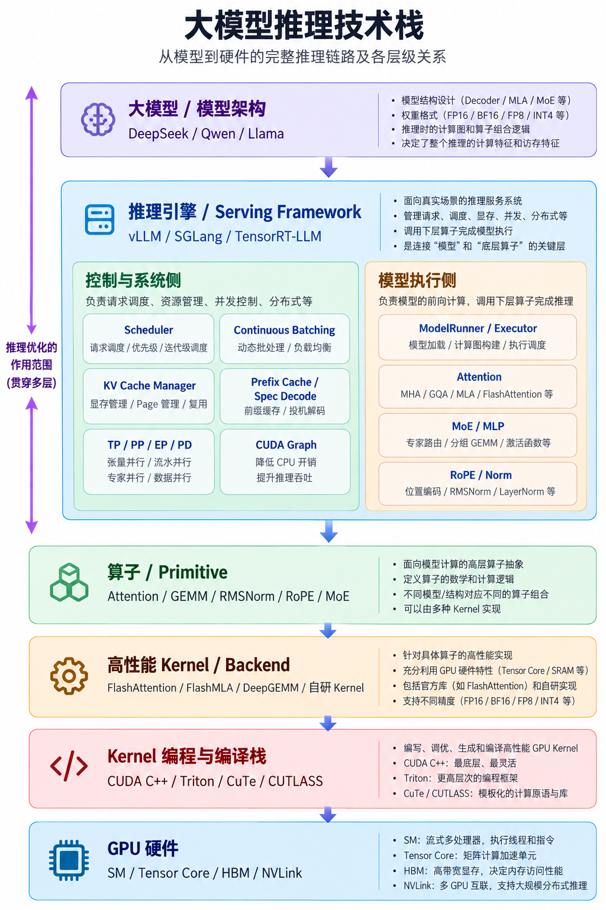
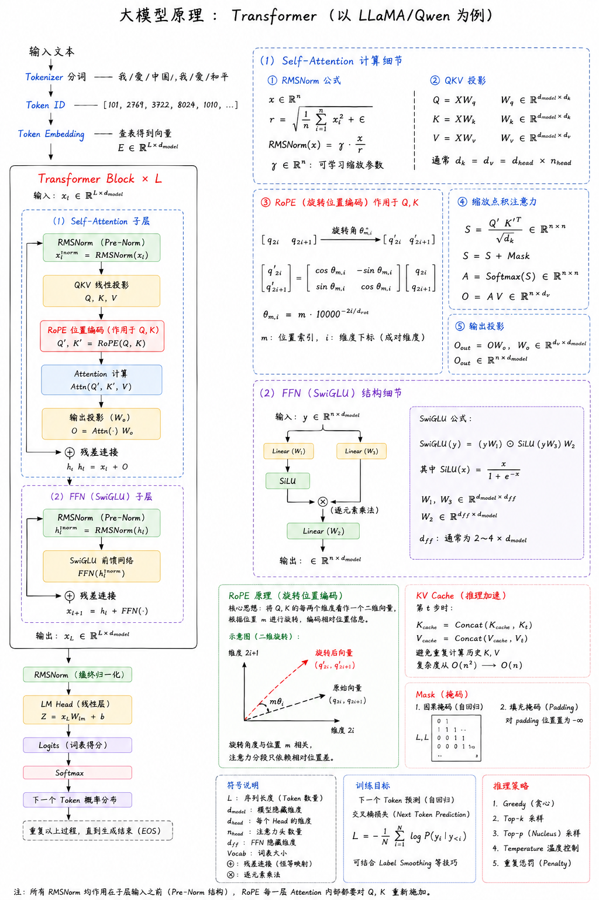
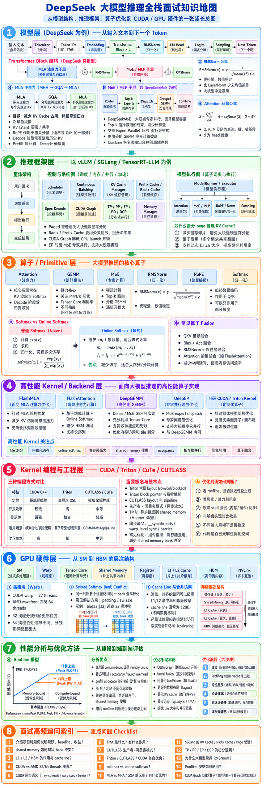

# MatInfer

**以问题为导向的大模型推理学习与工程实践。**

MatInfer 是一个持续积累的推理知识与实践仓库：从模型原理出发，理解请求怎样被组织执行，再深入算子、高性能 Backend、Kernel 编程与 GPU 性能分析。当前服务于有针对性的学习和秋招准备，后续继续承载工作中的问题、经验与项目。

这里同时提供体系化导航和深入学习的空间。知识主线相对稳定，具体专题、源码解读、实验与面试题随着学习逐步补充。训练目前不作为主线；理解推理所必需的背景知识可以按需加入。

> 当前状态：仓库框架与六层内容草案已建立。已有文本来自两份初始规划稿的整理；完整教程、面试答案和可运行实验仍需逐步完成。

## 推理知识地图

从模型到推理服务、算子、Kernel 与 GPU 硬件，先建立整体认识。



<details>
<summary>展开 Transformer 原理图（以 LLaMA / Qwen 为例）</summary>



</details>

<details>
<summary>展开 DeepSeek 推理全栈面试知识地图</summary>



</details>

这三张图用于全景学习与复习，目前保留原图。部分公式、结构与并行术语仍需修订，具体技术解释以相应专题正文为准。

## 从这里开始

- [知识总导航](导航.md)：六层主线、层间联系与专题入口。
- [仓库结构](结构.md)：各目录职责与内容归档方式。
- [学习路线](roadmap/README.md)：按体系学习、按问题深入和面试复习。
- [面试与自测索引](interview/README.md)：当前 70 道草案题目，链接回相应内容层。
- [实践实验](labs/README.md)与[项目入口](projects/README.md)：后续实验和延伸项目的归档位置。

## 六层知识主线

| 层次 | 核心问题 | 内容入口 |
| --- | --- | --- |
| 模型原理 | 一个 Token 在模型里怎样计算？ | [Transformer、DeepSeek、MLA、MoE](docs/01-model/README.md) |
| 推理框架 | 多个请求什么时候算、谁一起算、数据放哪里？ | [Scheduler、KV Cache、Batch、分布式推理](docs/02-serving/README.md) |
| 核心算子 | 计算由哪些算子组成，Shape 怎样影响性能？ | [GEMM、Attention、Norm、Routing、Fusion](docs/03-operators/README.md) |
| 高性能 Backend | 同一个算子怎样高效实现？ | [FlashAttention、FlashMLA、DeepGEMM、DeepEP](docs/04-backends/README.md) |
| Kernel 编程 | 怎样把计算映射为线程、内存、指令与同步？ | [CUDA、Triton、CUTLASS、CuTe](docs/05-kernel-engineering/README.md) |
| GPU 与性能分析 | Kernel 为什么慢，怎样验证优化有效？ | [SM、Memory、Roofline、Nsight](docs/06-gpu-performance/README.md) |

这些是解释与归档的层次，不是严格的运行时调用顺序。Serving 会调用模型，模型调用算子与 Backend；编程工具和 GPU 硬件支撑实现。跨层主题通过链接连接起来。

## 学习与积累方式

```text
具体问题 → 建立假设 → 学习原理 → 阅读源码 / 做实验
         → 验证结论 → 整理到专题 → 自测与面试追问
```

每个专题按实际进展积累：问题背景、原理与公式、数据 Shape、性能特征、实现或源码、实验结果、面试题和参考来源。内容少时先写一篇；内容多时再拆分目录。
