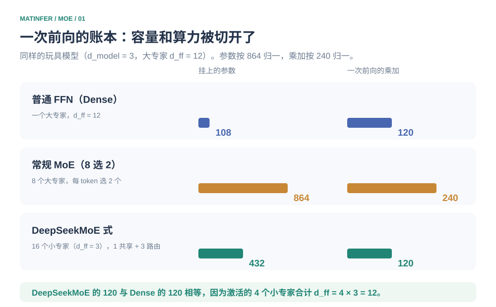
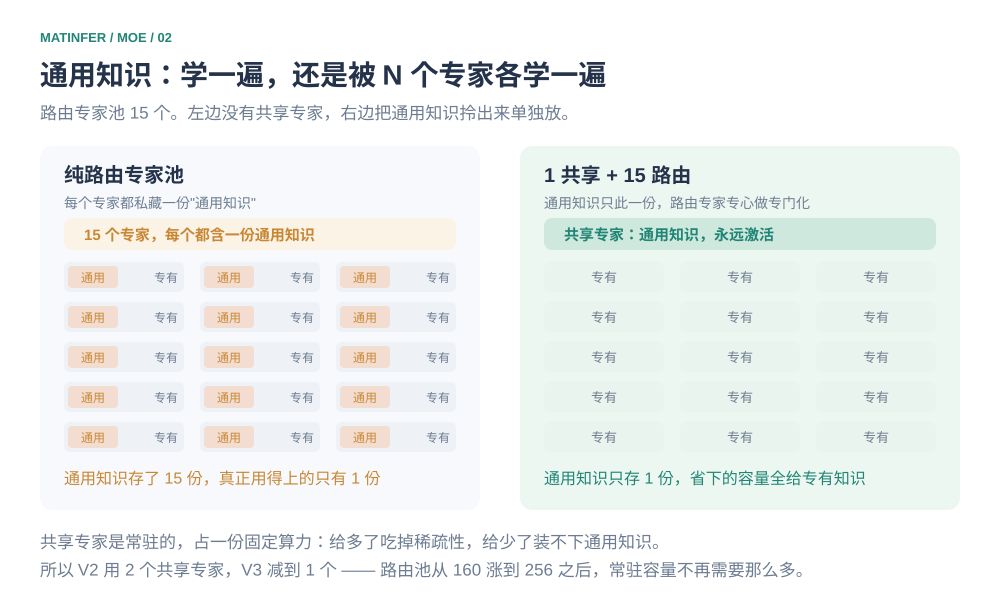
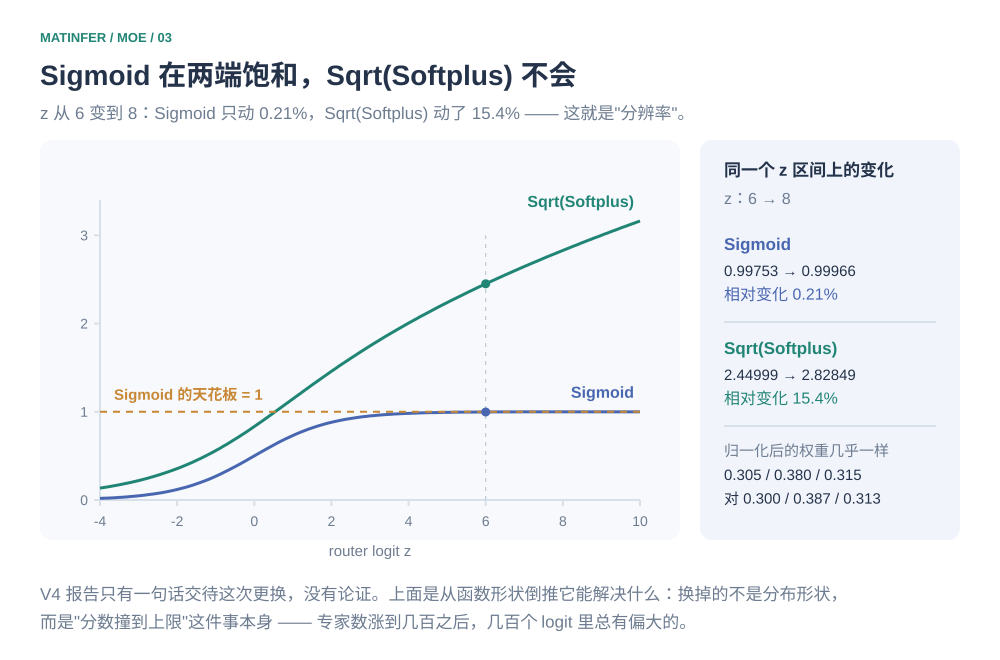
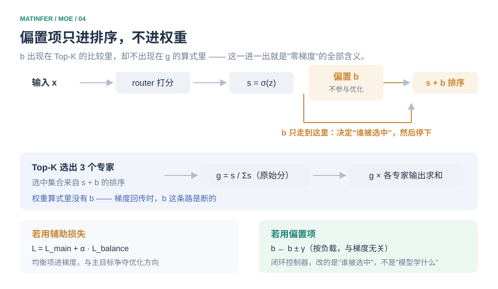
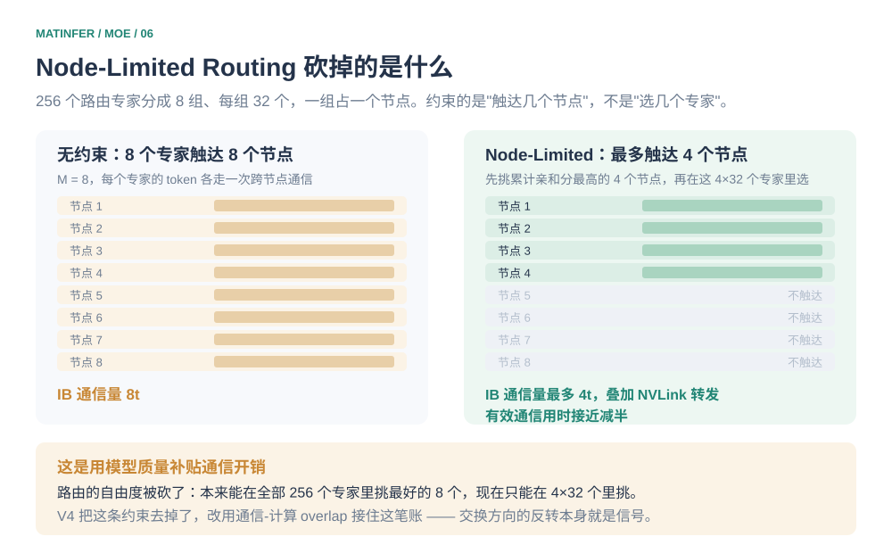

# 把 FFN 切成 256 份：DeepSeekMoE 如何用算力预算买到参数容量

2024 年 1 月，DeepSeek 挂出一篇叫《DeepSeekMoE: Towards Ultimate Expert Specialization》的论文。标题口气很大，配方却朴素得能一句话说完：**把一个大专家切成很多小专家，再挑几个固定成"永远激活"**。两年后，这套配方从 DeepSeek 自己的 V2 一路用到 V4，也被开源圈抄了个遍。

不过我在翻中文材料的时候，注意到一句被反复引用的话，而我认为它值得较真：

> MoE 用稀疏激活来省算力。

这句话如果指的是"同样的总参数量下，每次前向更便宜"，它成立。但它常常被读成"MoE 比同宽度的普通 FFN 快"——这就反了。拿一个 8 专家、每 token 选 2 的常规 MoE 来说，它一次前向的运算量恰好等于"两个大专家"，和一个宽度相当的普通 FFN 一模一样，一点没省；如果总容量固定成"8 个大专家"，普通 FFN 根本没法这么配，而 MoE 会激活其中两个——**是它的两倍**。

MoE 真正做的是另一件事：**把"模型有多大"和"跑一次要花多少"从同一根绳子上解下来**。普通 FFN 想加容量就必须加算力，两者锁死；MoE 让这两件事可以分开定价。它换来的不是速度，是"每单位算力能挂上多少参数"。

而这句话一旦说准，后面所有设计就都变成它的推论了——**本文想讲的，是一个解耦动作如何逼出了后面一整套看起来互不相干的机制**。

## 先把账算清

抽象地讲"解耦"容易含糊，用一组小到能心算的数字走一遍。

设模型维度 $d_{\mathrm{model}}=3$，一个大专家的中间维度 $d_{\mathrm{ff}}=12$。那么 $W_{\mathrm{gate}}$ 是 $3\times12$、$W_{\mathrm{up}}$ 是 $3\times12$、$W_{\mathrm{down}}$ 是 $12\times3$，一次前向的乘加次数是升维两次 $36+36$、逐元素相乘 $12$、降维 $36$，合计 $120$；参数量是 $36+36+36=108$。

现在把三条路并排放：

**普通 FFN（Dense）**：就一个这样的大专家。挂 **108** 个参数，花 **120** 次乘加。

**常规 MoE**：准备 8 个同样的大专家，每个 token 选 2 个。挂 **864** 个参数，花 **240** 次乘加。

**DeepSeekMoE 式**：先把大专家按 $m=4$ 切碎成 4 个 $d_{\mathrm{ff}}=3$ 的小专家，一共备 16 个；其中 1 个指定为共享专家（永远激活），剩下 15 个里每个 token 选 3 个。挂 **432** 个参数，花 **120** 次乘加。

三个数字放一起，能读出两件事。

第一件，Dense 的 108 变成 432——**参数翻了四倍，乘加次数一动没动**。这就是开头那句话的具体形状：容量和算力被切开了。

第二件更要紧：DeepSeekMoE 的 120 恰好等于 Dense 的 120，这不是巧合。被激活的 4 个小专家合计 $d_{\mathrm{ff}}=4\times3=12$，正好是 Dense 那个大专家的 $d_{\mathrm{ff}}$。**只要"激活的中间维度之和"不变，算力就一定不变**——切碎改变的是这 12 维装在几个专家里、以及仓库里有多少个专家在等着被挑。所以那句"细粒度省算力"的准确版本是：**细粒度不省算力，它改变参数的组织方式**。

再看常规 MoE 那一行：它花了两倍的算力，参数只多了两倍（864 对 432），而且那 864 个参数里，每个大专家都在重新学一遍"什么是语法"这类所有 token 都要的东西。这份冗余，是下一篇里共享专家要挤掉的水分。



*图 1　同样一次前向，三条路能挂上的参数差了八倍。省下的从来不是算力，是"每单位算力买到的容量"。*

## 切碎

为什么要切碎，原论文给的理由是**专门化的粒度**。

一个 $d_{\mathrm{ff}}=12$ 的大专家，得同时负责语法、数学、代码；它的权重是所有知识的叠加，你想调整其中任何一块，都会牵动另外两块。切成 4 个 $d_{\mathrm{ff}}=3$ 的小专家之后，每块的容量只有原来的四分之一，**这迫使它必须挑一样东西专注地学**，否则什么都学不像。

而一旦专家变小、变多，可组合的空间就打开了。上面那个玩具模型里，15 个路由专家选 3 个，有 $\binom{15}{3}=455$ 种组合；Dense FFN 只有 1 种。455 种组合意味着模型可以给不同 token 装配不同的子网络，这就是"专家专门化"真正的自由度来源。

也许会有人问：那就一路切到底，切到每个专家只有一个神经元，组合数不是更大吗？不行。两个代价立刻会顶上来：单专家变小之后，它对应的 GEMM 也跟着变小，算术强度下降，GPU 的利用率会明显变差；同时路由本身的计算与通信开销是固定的，专家越小，这部分占比越高。**切碎到一个最优粒度就停**，粗了专门化不足，细了工程上不划算。

## 谁在重复学语法

切碎解决的是专有知识，但它带来了一个新问题：通用知识怎么办？

像"主谓宾的顺序"、常见虚词的用法这类东西，**每一个 token 都需要**。在纯竞争性的路由专家里，它们会被 N 个专家各自学一遍——参数是花了，知识只学了一份，剩下 $N-1$ 份是纯冗余。

DeepSeekMoE 的处理方式很直接：从专家池里拎出若干个，标成**共享专家**，永远激活、不参与路由竞争。于是通用知识只学一遍，剩下的路由专家可以心无旁骛地做垂直领域的专门化。上面那个玩具模型里，1 个共享专家 + 3 个路由专家构成一次前向，共享专家的输出直接是无权重的加法项：

```math
\mathbf{y}=\mathrm{FFN}_{\text{shared}}(\mathbf{x})+\sum_{i\in\text{Top-}K}g_i\,\mathrm{FFN}_i(\mathbf{x})
```

这里有个容易被忽略的取舍：共享专家是常驻的，它在**每次前向的算力里都要占一份**。给多了，稀疏性被吃掉，MoE 省下来的东西又还回去了；给少了，装不下通用知识，路由专家还是得偷偷学。DeepSeek 两个版本的选择值得看一眼——V2 用了 **2** 个共享专家，V3 减到 **1** 个。这个方向有点反直觉，但理由很顺：路由池从 160 个涨到 256 个、粒度更细之后，通用知识不需要那么多常驻容量来扛了。**常驻容量和路由容量是此消彼长的关系。**



*图 2　共享专家挤掉的不是算力，是"同一份通用知识被重复存储 N 遍"的冗余。*

## 分数不该互相竞争

专家多了之后，路由这件事本身开始出问题。先说一个很多人会答错的点。

DeepSeekMoE 早期（以及更早的 Switch Transformer 一系）用的是 **Softmax** 门控。Softmax 是**零和**的：给一个专家加分，必然等于从其他专家身上减分。专家只有几十个的时候这是好事，分数被拉开，路由更果断。但专家数涨到几百，麻烦来了——Softmax 会把分数往两端推，绝大多数专家挤在接近 0 的位置，彼此几乎没有区别，而且对输入扰动很敏感。

V3 换成了 **Sigmoid**。Sigmoid 逐个专家独立打分，专家之间不再耦合，谁高谁低互不影响。代价是分数失去了自发的归一性，所以要在选出 Top-$K$ 之后补一次归一化：

```math
s_{i}= \mathrm{Sigmoid}(\mathbf{u}^{\top}\mathbf{e}_i),\qquad
g_{i}=\frac{g'_{i}}{\sum_{j}g'_{j}},\qquad
g'_{i}=
\begin{cases}
s_{i}, & s_{i}+b_{i}\in \operatorname{TopK}(\{s_{j}+b_{j}\},K),\\
0, & \text{otherwise}.
\end{cases}
```

**这里正是最常被写错的一处：V3 / V4 得到门控权重用的是"归一化"（除以被选中分数之和），不是 Softmax。** 论文原话是 "applies a normalization among all selected affinity scores"，而 Softmax 门控是 V2 及更早的做法。差别不只是名词——用一组数看最清楚。

假设某个 token 选中的三个专家，原始亲和分是 $s=1/5,\ 9/10,\ 3/10$（为什么是这些分数稍后交代，它们正好是 Sigmoid 能精确给出的值）：

| 门控方式 | $g$（三个专家） | 分配形状 |
| --- | --- | --- |
| 归一化（V3 / V4 实际做法） | $1/7 \approx 0.143$、$9/14 \approx 0.643$、$3/14 \approx 0.214$ | 0.9 分那位拿到约 64% |
| Softmax（若误用） | $0.243$、$0.489$、$0.268$ | 最平均 |

方向值得留意：**这里 Softmax 反而更"平"**。原因是 Sigmoid 分数全部落在 $(0,1)$ 内，最大最小只差 0.7；Softmax 又做了平移不变处理，只认差值，于是把这点差距抹平了。归一化保留绝对大小，0.9 那一项就拿到了压倒性权重。**"Softmax 更锐利"是个想当然的印象，锐不锐要看分数落在哪个区间。**

那 V4 为什么还要再换一次？因为 Sigmoid 有个躲不掉的毛病：**它在两端饱和**。专家数涨到几百、几百个 logit 里总有偏大的，一旦 $z$ 上去了，$s=\sigma(z)$ 全都挤向 1。看具体数字：$z$ 从 6 变到 8，$\sigma$ 只从 $0.99753$ 变到 $0.99966$，**相对变化 0.21%**——路由这时候基本失去了分辨能力，梯度也趋近于零。

V4（2026 年 4 月）把打分函数换成了 $\sqrt{\operatorname{Softplus}(\cdot)}$。论文只有一句话，没有论证，所以这里只能从函数形状倒推它解决了什么：Softplus 在上方**不饱和**（$z$ 大时 $\approx z$），且恒为正，$\sqrt{\ }$ 再把值域压一压。同样 $z$ 从 6 到 8，$\sqrt{\operatorname{Softplus}}$ 从 $2.450$ 变到 $2.828$，**相对变化 15.4%**——比 Sigmoid 的 0.21% 高两个数量级。归一化之后权重的对比也能看出，换成 $\sqrt{\operatorname{Softplus}}$ 后分配形状和 Sigmoid 几乎一样（$0.305/0.380/0.315$ 对 $0.300/0.387/0.313$）：**V4 换掉的不是分布形状，而是"天花板"这件事本身。**



*图 3　同一个 logit 区间里，Sigmoid 已经贴到 1 上，$\sqrt{\operatorname{Softplus}}$ 还在线性地爬。*

## 均衡不该写进损失

路由还有一个更棘手的问题：负载不均衡。如果大多数 token 都涌向同几个专家，这几个专家就成了瓶颈，其余的在旁边闲置。在专家并行下这不是质量问题，是效率事故。

常规解法是加一项**辅助损失**，在目标函数里惩罚不均衡。但这一项和"模型该学什么"是竞争关系——它逼着模型放弃更优的路由去换均匀。V3 论文的措辞很直白：辅助损失太大会损害模型性能。

V3 的做法是把均衡从损失里搬出来，放进一个**只影响选择、不影响输出**的偏置项 $b_i$。它出现在排序里（$s_i+b_i$ 决定谁进 Top-$K$），但**不出现在门控权重里**（$g_i$ 只用原始 $s_i$ 算，见上一节的公式）。于是它不产生任何梯度——$b$ 不是学出来的参数，而是一个闭环控制器：这一步谁过载就减一点，谁闲置就加一点。

这个设计的价值，看 V3 报告里的消融最清楚。同一套数据和架构，一边保留辅助损失，一边全部去掉换成偏置方案（228.7B 总参数 / 20.9B 激活，训练 578B token）：

| 基准（Metric） | 辅助损失方案 | 无辅助损失方案 |
| --- | --- | --- |
| MMLU（EM） | **68.3** | 67.2 |
| BBH（EM） | 66.7 | **67.9** |
| HumanEval（Pass@1） | 40.2 | **46.3** |
| GSM8K（EM） | 70.7 | **74.5** |
| MATH（EM） | 37.2 | **39.6** |

HumanEval 从 40.2 涨到 46.3 确实可观。但请注意 MMLU 那一行：**无辅助损失方案反而低了 1.1 分**。论文自己的总结用的是 "consistently achieves better model performance on **most** of the evaluation benchmarks"——是 most，不是 all。这类方案不是全面碾压，把它说成"辅助损失有害所以不用了"是不准确的。

更准确的机制藏在论文的另一组实验里。作者问了一个更细的问题：有害的到底是"加了一项损失"，还是"要求**每条序列内部**都均衡"？他们把约束从序列级放宽到 batch 级，结果是——**batch 级辅助损失的表现和无辅助损失方案完全持平**。1B MoE 的验证损失：序列级 $2.258$、无辅助损失 $2.253$、batch 级 $2.253$；3B 上分别是 $2.085$、$2.080$、$2.080$。

这就把机制说通了。序列级约束要求"每一句话都均匀用到所有专家"，可专家的分工是跨整个语料长出来的——一句话里本来就只该有几个专家相关，硬要它均匀，等于在句子尺度上否定专门化。放宽到 batch 级，这种偏科就被允许了，损失也就不再和主目标打架。论文还顺手给了旁证：无辅助损失的模型在不同领域的专家负载图上，聚类比辅助损失版本干净得多。



*图 4　$b$ 出现在 Top-$K$ 的比较里，却不出现在 $g$ 的算式里——这一进一出，就是"零梯度"的全部含义。*

## 一个 1×6 的完整前向

到这里，四个部件（细粒度、共享专家、Sigmoid 打分、偏置均衡）都各自讲完了。但它们合起来跑一次到底是什么样子，还是得走一遍数据。

取输入 $\mathbf{x}=[1,2,0,1,0,2]$，$d_{\mathrm{model}}=6$，每个专家的 $d_{\mathrm{ff}}=3$，一共 8 个专家：$E_1$ 是共享专家，$E_2\sim E_8$ 共 7 个路由专家，每个 token 选 3 个。

先看路由。路由器是一个 $6\times7$ 的矩阵（$d_{\mathrm{model}}\times$ 路由专家数），$\mathbf{x}W_{\mathrm{router}}$ 一口气给出 7 个亲和分。这些分数我特意挑成 Sigmoid 能精确取到的值——因为 $\sigma(\ln\frac{q}{p})=\frac{q}{q+p}$，所以只要 logit 写成 $\ln$ 的形式，分数就是干净的分数：

```math
s = \big[\,\tfrac12,\ \tfrac45,\ \tfrac15,\ \tfrac9{10},\ \tfrac1{10},\ \tfrac35,\ \tfrac3{10}\,\big]
```

对应的 logit 是 $[\,0,\ \ln4,\ -\ln4,\ \ln9,\ -\ln9,\ \ln\frac32,\ \ln\frac37\,]$。**顺带注意这些分数全部落在 $(0,1)$ 内**——这正是上一节说的 Sigmoid 特征，它不会像 Softmax 那样把分数推到两端。

再给每个路由专家配一个偏置（就是上一节的 $b$，可以理解成"上一轮谁被冷落了"）：

```math
b = \big[\,\tfrac1{10},\ -\tfrac12,\ \tfrac35,\ -\tfrac1{10},\ \tfrac15,\ 0,\ \tfrac25\,\big]
```

修正分 $s'=s+b$ 立刻见分晓：$E_3$ 从 $4/5$ 被压到 $3/10$，$E_4$ 从 $1/5$ 被抬到 $4/5$。按 $s'$ 排序选 3 个，结果是 $E_4,E_5,E_8$；而如果只看原始分 $s$，选的会是 $E_5,E_3,E_7$——**被换掉的正是最受欢迎的 $E_3$ 和最不受待见的 $E_4$**。这就是那个闭环控制器在干活。

然后是门控权重，用**原始分**、**归一化**（不是 Softmax）：选中的分数之和是 $\frac15+\frac9{10}+\frac3{10}=\frac75$，于是

```math
g_{E_4}=\frac{1/5}{7/5}=\frac17,\qquad
g_{E_5}=\frac{9/10}{7/5}=\frac9{14},\qquad
g_{E_8}=\frac{3/10}{7/5}=\frac3{14}
```

三个加起来恰好是 1，可以自查。

最后是专家内部。让所有专家的 $W_{\mathrm{gate}}$ 元素都取 $0.1$，于是升维后的 gate 分量恒为 $\mathbf{x}\cdot 0.1=6\times0.1=0.6$——**取成同一个值是为了让每个专家共用同一个激活值**，手算少一个变量。记 $c=\operatorname{Swish}(0.6)=0.6\times\sigma(0.6)=0.387394$，再让各专家的 $W_{\mathrm{up}}$ 与 $W_{\mathrm{down}}$ 取不同常数：

| 专家 | $W_{\mathrm{up}}$ | $W_{\mathrm{down}}$ | 输出 $y=18c\cdot u\cdot\delta$ |
| --- | --- | --- | --- |
| $E_1$（共享） | $1$ | $1/12$ | $1.5c=0.5811$ |
| $E_4$ | $1$ | $1/6$ | $3c=1.1622$ |
| $E_5$ | $3/2$ | $1/6$ | $4.5c=1.7433$ |
| $E_8$ | $1$ | $1/9$ | $2c=0.7748$ |

**这里不能用"所有专家的权重都相同"的设定**——那样任何专家的输出都必然一样，加权求和就演示不出任何东西了，这也是我偏离常见讲法的地方。

按公式 $\mathbf{y}=\mathrm{FFN}_{\text{shared}}(\mathbf{x})+\sum g_i\mathrm{FFN}_i(\mathbf{x})$ 合并：

```math
\mathbf{y}=0.5811+\tfrac17\times1.1622+\tfrac9{14}\times1.7433+\tfrac3{14}\times0.7748
=0.5811+0.1660+1.1207+0.1660=2.0338
```

$E_4$ 和 $E_8$ 贡献的是同一个数（$0.1660$），也不是巧合：它们满足 $\frac{2}{14}\times3c=\frac{3}{14}\times2c$，权重比的倒数和输出比的倒数正好抵消。整式的精确形式是 $\frac{21}{4}c$——**先把 $21/4$ 这个比例算出来，再乘 $c=0.387394$，就不必逐项按计算器了。**

这个 $\mathbf{y}$ 是 MoE 子层的输出，最后还要经残差连接 $\mathbf{x}+\mathbf{y}$ 回到主干、进入下一层。**MoE 替换掉的只是 FFN 这一块，Transformer 的骨架一动没动**——这也是它能直接嵌进既有架构、还被各家抄了个遍的原因。


*图 5　五步循环：算分 → 加偏置排序（$E_3$ 出局、$E_4$ 上位）→ 归一化取权重 → 四个专家各自前向 → 合并。*

## 通信的账单

上面所有讨论都默认"专家就在手边"。真实训练不是：**专家并行**（**EP**）把这些专家摊到几十上百张卡、好几个物理节点上，一个 token 的 3 个或 8 个专家很可能落在不同节点。于是每次路由都要做一次 **All-to-All**——把 token 送过去算，再把结果收回来。

这笔账单的大小，大致正比于一个 token 触达的**节点数** $M$，而不是专家数。所以 V3 干了一件很实用的事：把 256 个路由专家分成 8 组、每组 32 个，一组放一个节点；然后**在算法上限制每个 token 最多触达 4 个节点**（$M\le4$）。论文给的账是：跨节点 InfiniBand 通信量从 $8t$ 降到最多 $4t$，叠加节点内 NVLink 转发（带宽高得多），有效通信用时接近减半。

代价也很清楚：路由的选择自由度被砍了。本来可以在全部 256 个专家里挑最好的 8 个，现在只能在"累计亲和分最高的 4 个节点"内部的 $32\times4$ 个专家里挑。这是**用模型质量补贴通信开销**——一个明摆着的交换。

V4 把这条约束**去掉了**。论文原话是 "we remove the constraint on the number of routing target nodes, and carefully redesign the parallelism strategy to maintain training efficiency"。注意后半句——它没有靠"反正影响不大"来justify，而是重新设计了并行策略，用 kernel 层面的通信-计算重叠把这笔账接住了。**这个交换方向的反转本身就是个信号：当 overlap 做得足够好，通信就不再是需要动用模型质量去补贴的东西了。**



*图 6　约束从"专家数"挪到"节点数"，$M$ 从 8 降到 4。V4 把这条约束整个撤了。*

## 一年半以后

把 V2（2024 年 5 月）到 V4（2026 年 4 月）的 MoE 侧配置排一排，能看出这条线在往哪走：

| | V2 | V3 | V4-Flash | V4-Pro |
| --- | --- | --- | --- | --- |
| 总参数 / 激活参数 | 236B / 21B | 671B / 37B | 284B / 13B | 1.6T / 49B |
| 激活比例 | 8.90% | 5.51% | 4.58% | 3.06% |
| 共享专家 | 2 | 1 | 1 | 1 |
| 路由专家 / 激活数 | 160 / 6 | 256 / 8 | 256 / 6 | 384 / 6 |
| 亲和度函数 | Softmax | Sigmoid | Sqrt(Softplus) | Sqrt(Softplus) |
| 路由节点上限 | 设备级 | 4 个节点 | 已取消 | 已取消 |

两件事值得单独拎出来。

**激活比例在持续变稀，而且主要是靠"多备专家"而不是"少选专家"做到的。** V3 到 V4-Flash，专家数没变（都是 256），激活数从 8 降到 6；V4-Pro 干脆把池子扩到 384，激活数还是 6。这和第一节那个账本是同一件事的长期版本：容量往上加，算力按住不动。

**路由这件事被拆开处理了。** V4 在最前面 3 个 MoE 层改用 **Hash routing**——按 token id 的哈希直接决定去哪个专家，完全不做学习。理由说得通：早期层的隐状态还没有形成语义，此时的 router 其实没什么可挑的，而偏置控制器也才刚起步；那就把这个"无从下手"的活儿交给一个确定性映射，等隐状态有内容了再交还给学出来的路由。**同一个机制在不同深度上，值不值得学是不一样的。**

## 补充说明

**1、关于"MoE 是不是更快"。** 把账彻底算清：给定激活算力，MoE 和 Dense 一次前向的开销相同；MoE 的收益是同算力能挂更多参数。反过来说它的代价在**显存**——所有 $N$ 个专家的权重都得装下，哪怕一个 token 只碰其中几个。V4 把专家权重压到 FP4，一半原因在这里。另半个代价就是上一节的 All-to-All。

**2、关于偏置项的量级。** 更新步长 $\gamma$ 很小（公开配置里是 $1\times10^{-3}$），所以 $b$ 是个**慢变量**：要让某个专家的偏置移动 0.5，需要连续几百步同向的过载或闲置。它的作用是纠正长期漂移，不是调度当前这一步。前面例子里 $b_{E_4}=+\frac35$ 这种量级，对应的是几百步累积出来的结果。

**3、关于那个"错误"的 Softmax。** 说它错，是说 V3 / V4 不用它；Softmax 门控在 V2 和更早的 MoE 上是标准做法，并没有"写错"。真正要警惕的是把两者混着讲——**公式里的打分函数换了，取权重的方式往往也跟着换**，这两件事是一起变的。

**4、关于算例的取值。** 玩具模型的维度（$d_{\mathrm{model}}=3$ 或 $6$、$d_{\mathrm{ff}}=3$）和真实模型差得很远，取这么小纯粹是为了能手算。真实模型里 $W$ 的每个元素都不同，但"升维 → 逐元素乘 → 降维"的数据流和权重归一化的位置完全一样。

**5、关于引用口径。** V3 的消融数字取自 arXiv:2412.19437 表 5（228.7B 总参数 / 20.9B 激活）与 §4.5.3（1B、3B MoE 的验证损失）。V4 的亲和度函数与取消节点约束两句，是 V4 技术报告原文；V4 的 hash routing、以及训练稳定性上的钳位与"用稍过期参数算路由"等措施，来自该报告及第三方解读，我只取配置层面能对上的部分，机制细节不在此展开。

## 小结

MoE 被介绍给人时，通常配一句"稀疏激活省算力"。这句话在最容易被检验的那一面其实是反的——同样激活算力下，MoE 一点不比 Dense 便宜，甚至更贵。它做的是把**容量**和**算力**拆开定价，这是它的全部收益，也是它所有麻烦的来源。

拆开之后，麻烦依次到齐：切碎的专家会重复学通用知识（→ 共享专家）；专家一多，Softmax 的零和性让分数失去区分度（→ Sigmoid，V4 再换 $\sqrt{\operatorname{Softplus}}$）；再一多，负载均衡不能用辅助损失硬压（→ 只进排序的偏置项，而且真正有害的是"序列级"约束）；专家摊到不同节点，通信成了新一轮瓶颈（→ Node-Limited Routing，V4 又靠 kernel 工程把它撤了）。

如果面试里要讲这件事，别从"专家""路由""稀疏"这些词开始。**从一次前向的账本开始**：参数挂了多少、乘加花了多少，把 Dense、常规 MoE、DeepSeekMoE 三条路并排算一遍——然后说"容量和算力可以分开定价，其余都是它的副作用"。沿着这条线走，比背下 256、8、$b_i$、$\sqrt{\operatorname{Softplus}}$ 这一串数字牢固得多。

## 附录 A：一个最小实现

下面这个片段省掉了工程细节（分布式调度、Grouped GEMM、容量因子），只保留让上面的公式成立的骨架。`bias` 是 buffer 而不是 `Parameter`，这一点是全篇的关键——它必须不接收梯度。

```python
class MoELayer(nn.Module):
    def __init__(self, d_model, d_ff, n_routed, n_shared, top_k):
        super().__init__()
        self.top_k = top_k
        self.router = nn.Linear(d_model, n_routed, bias=False)
        self.routed = nn.ModuleList(SwiGLU(d_model, d_ff) for _ in range(n_routed))
        self.shared = nn.ModuleList(SwiGLU(d_model, d_ff) for _ in range(n_shared))
        # 只用于排序的偏置：buffer，不参与优化
        self.register_buffer("bias", torch.zeros(n_routed))

    def forward(self, x):                      # x: [T, d_model]
        y = sum(e(x) for e in self.shared)      # 共享专家：永远激活，不加权
        s = torch.sigmoid(self.router(x))       # [T, n_routed]
        idx = (s + self.bias).topk(self.top_k, dim=-1).indices
        g = s.gather(-1, idx)
        g = g / g.sum(-1, keepdim=True)         # 归一化，不是 softmax
        for k in range(self.top_k):
            ek, gk = idx[:, k], g[:, k]
            for e in range(len(self.routed)):
                m = ek == e
                if m.any():
                    y[m] += gk[m, None] * self.routed[e](x[m])
        return y

    @torch.no_grad()
    def update_bias(self, load, gamma=1e-3):    # 闭环控制器，与梯度无关
        self.bias += gamma * torch.sign(load.mean() - load)
```

## 附录 B：面试问答

**问：MoE 是为了降低训练成本，还是为了高效推理？**

两个阶段都受益，但它解决的核心是**模型容量与计算成本的矛盾**，不是"推理更快"。Dense 模型想变强就得加参数，而每个 token 都要跑完全部参数，成本线性飙升；MoE 把总参数做得很大，却让单个 token 只走少数几个专家，于是计算量可控而容量不受限。**推理侧并没有因此变快**——同算力下它和 Dense 一样贵，它的优势是同容量下更便宜。代价是路由开销与 All-to-All 通信，专家并行时尤其明显。

**问：为什么 V3 把门控从 Softmax 换成 Sigmoid？**

Softmax 是零和的，一个专家的分数上升必然压低其他专家；专家少的时候这能拉开区分度，专家涨到几百之后反而把绝大多数分数挤到接近 0，区分度变差且对扰动敏感。Sigmoid 逐个独立打分，专家间解耦，代价是需要在选出 Top-$K$ 后补一次归一化。所以 V3 门控权重是"选中分数除以和"，不是 Softmax——这一点经常被讲混。

**问：无辅助损失负载均衡到底"无"在哪？**

无在**它不写进损失函数**。每个专家有一个偏置 $b_i$，只加到排序分数上（决定谁进 Top-$K$），不进门控权重（$g$ 仍用原始亲和分算），因此不产生任何梯度——它不是学出来的参数，而是按负载反馈调整的闭环控制器。意义在于避免了辅助损失与主目标争夺优化方向。不过要注意两点：一是它并非全面更优（V3 消融里 MMLU 反而低 1.1 分），二是 V3 仍保留了一个权重极小的序列级辅助损失做兜底。

**问：如果让你把专家数从 256 加到 1024，你会同时改什么？**

至少四件事要一起看。单专家 $d_{\mathrm{ff}}$ 得相应调小，否则总参数和显存直接失控；打分函数的饱和度问题会更严重（专家越多，logit 分布越宽），这也是 V4 换 $\sqrt{\operatorname{Softplus}}$ 的背景；路由节点上限的取舍会更尖锐，因为可选专家摊得更开，通信扇出更难压；最后是负载均衡，池子越大越容易长尾，偏置的步长与 batch 级约束的强度都得重新标定。**这四项不是独立的旋钮，它们共用同一个算力预算。**

---

[Attention 与 FFN](../transformer/attention-and-ffn.md) · [Online Softmax](../../03-operators/attention/online-softmax.md) · [返回模型原理](../README.md)
