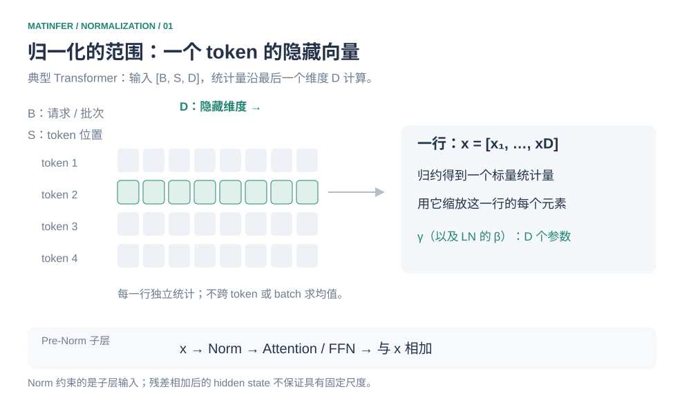
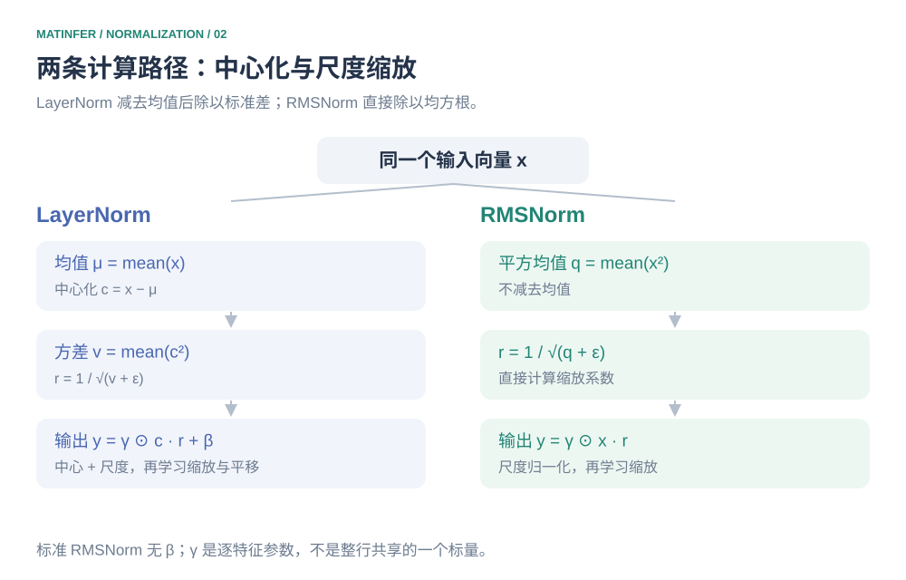
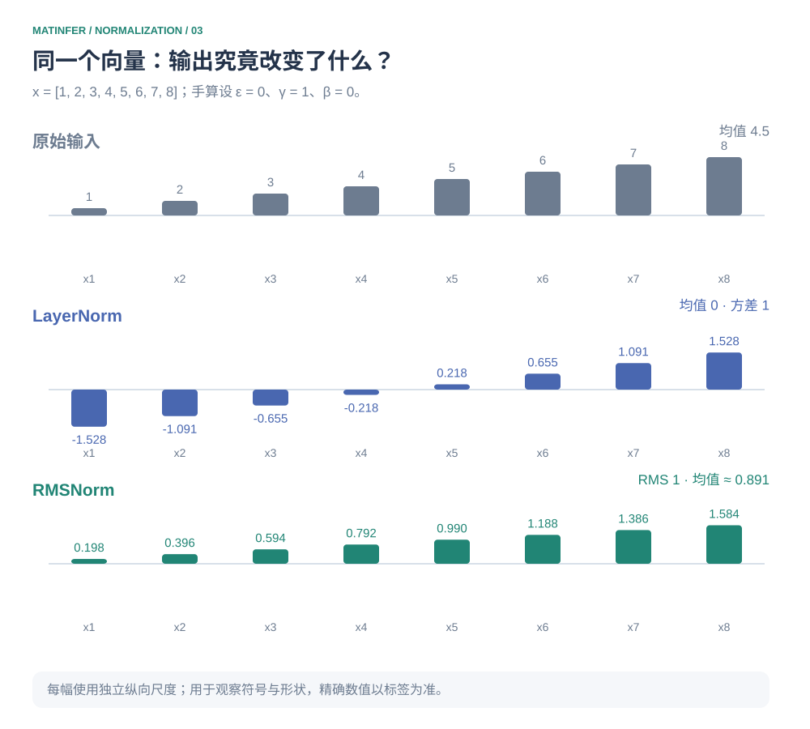
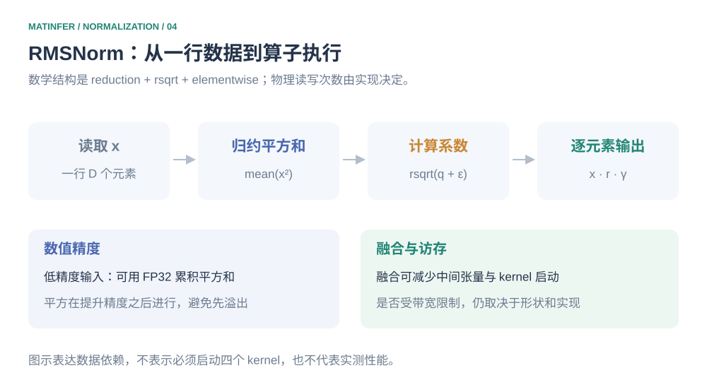

# 从 LayerNorm 到 RMSNorm：归一化究竟改变了什么

在 Transformer 里，Norm 看起来只是 Attention 或 FFN 前后的一小步。但如果说它只是“让数值稳定”，仍然没有回答几个关键问题：对谁做归一化？哪些信息被改变，哪些被保留？为什么 RMSNorm 可以省去减均值？公式又怎样变成 GPU 上的实际工作？

这篇从一个 token 的隐藏向量出发，用同一组数字走完 LayerNorm 和 RMSNorm，再把数学过程对应到实现。重点是理解两种方法的区别，不讨论如何把已有模型中的一种 Norm 直接替换成另一种。

## 1. 先确定范围：对一个 token 的哪些数做归一化



*图 1　典型 Transformer 的 Norm 对每个 token 的隐藏维度独立计算统计量。图下方示意一个 Pre-Norm 子层；一个 Block 的 Attention 和 FFN 通常各有自己的 Norm。*

假设输入形状是 `[B, S, D]`：B 是批次大小，S 是序列长度，D 是隐藏维度。本文使用 `normalized_shape=D`，于是每个 `[b, s, :]` 向量单独做归一化。它不需要先把不同 token 或不同请求的数据合起来统计；同一模块的可学习参数则在这些位置共享。[^pytorch-ln]

例如输入是 `[2, 3, 8]`，就有六个长度为 8 的向量。LayerNorm 为每个向量计算自己的均值和方差，RMSNorm 为每个向量计算自己的平方均值；若启用逐元素仿射参数，每个模块的 γ 有 8 个元素，LayerNorm 的 β 也有 8 个元素，而不是每个 token 都单独存一组参数。

### 为什么需要控制尺度

Transformer 的残差结构不断把子层输出加回隐藏状态。这并不意味着数值必然逐层增大，但输入尺度的变化会影响后续计算：线性投影的输出随输入缩放，而 Q、K 的尺度变化还会影响 Attention logits 和 Softmax 的尖锐程度。

以一个 Pre-Norm Attention 子层为例：

```math
h = x + \mathrm{Attention}(\mathrm{Norm}(x)).
```

Norm 为进入子层的输入提供尺度控制，残差路径仍然保留原始 x。这里需要分清两个对象：**归一化后的子层输入，以及残差相加后的隐藏状态**。前者的统计性质由归一化公式决定；后者并不因此具有固定的均值、方差或 RMS。

归一化有助于网络的优化与数值行为，但不能单独保证整个网络稳定。Norm 的位置、残差结构、参数以及具体计算精度都会影响结果。在推理中，γ、β 通常使用已训练好的固定参数；这一步仍然参与每次前向计算，不能因“不训练”就省略。

## 2. 两条计算路径：减去均值，还是只缩放尺度



*图 2　LayerNorm 先中心化再按标准差缩放；标准 RMSNorm 直接按均方根缩放。图中的统计量是每行一个标量，γ 和 β 是沿隐藏维度的向量。*

定义一个长度为 D 的输入向量 x。LayerNorm 先计算均值，再计算偏离均值的程度：

```math
\mu = \frac{1}{D}\sum_{i=1}^{D}x_i, \qquad
\sigma^2 = \frac{1}{D}\sum_{i=1}^{D}(x_i-\mu)^2.
```

然后减去均值、除以带 ε 的标准差，并施加可学习的缩放与平移：

```math
\hat{x}_i = \frac{x_i-\mu}{\sqrt{\sigma^2+\epsilon}}, \qquad
y_i = \gamma_i\hat{x}_i+\beta_i.
```

这里的方差除以 D，不是样本方差估计里的 D−1。γ、β 各有 D 个参数：它们让模型在归一化之后重新学习各个特征适合的尺度和偏置。[^pytorch-ln]

RMSNorm 的分母使用平方均值，不需要先减去均值：

```math
r = \sqrt{\frac{1}{D}\sum_{i=1}^{D}x_i^2+\epsilon}, \qquad
y_i = \gamma_i\frac{x_i}{r}.
```

严格来说，RMS 是平方均值的平方根；上面的 r 是加入 ε 后用于计算的分母。标准 RMSNorm 使用 γ，不包含 β。[^pytorch-rms]

| 符号 | 含义 | 在计算中承担什么作用 |
| --- | --- | --- |
| D | 本次归一化的特征数 | 决定统计量的范围；本文对应隐藏维度 |
| ε | 加入分母的正数 | 避免零分母，并影响接近零时的缩放强度 |
| γ | 逐特征可学习缩放 | 允许各特征使用不同尺度，不是整行统一的一个参数 |
| β | 逐特征可学习偏置 | LayerNorm 仿射变换中的平移项 |

### 平方均值与方差究竟差在哪

两种分母的关系可以直接从展开平方得到：

```math
\sigma^2
= \frac{1}{D}\sum_i (x_i-\mu)^2
= \frac{1}{D}\sum_i x_i^2-\mu^2.
```

因此：

```math
\frac{1}{D}\sum_i x_i^2 = \sigma^2+\mu^2.
```

这说明 RMS 同时受到均值和围绕均值的波动影响；标准差只衡量后者。当均值为零、ε 相同，并使用相同 γ 和零 β 时，两种 Norm 的输出一致。均值不为零时，RMSNorm 的分母通常更大，而且没有减去均值，不能把它当成 LayerNorm 的同一个输出。

省略中心化减少了数学步骤，但“中心化是否有必要”是模型设计与任务相关的问题。RMSNorm 原论文提出并实验考察了去掉中心化的方案；不能由此推出任意模型都可以无损替换 Norm。[^rms-paper]

## 3. 用同一组数字，看两种 Norm 改变了什么



*图 3　三组数据分别绘制。各幅纵向尺度独立，观察符号与形状时结合数值标签；它们不是共享纵轴的幅值比较图。*

使用输入 `[1, 2, 3, 4, 5, 6, 7, 8]`。为了方便手算，本节设 ε＝0、γ 全为 1、β 全为 0。这组输入的方差和 RMS 均非零，因此本次计算有效；实际实现保留正的 ε。

### LayerNorm：先移动中心，再缩放

元素和是 36，均值是 4.5。减去均值得到：

```math
x-\mu = [-3.5,-2.5,-1.5,-0.5,0.5,1.5,2.5,3.5].
```

这些偏差的平方是 `[12.25, 6.25, 2.25, 0.25, 0.25, 2.25, 6.25, 12.25]`，总和为 42。因此：

```math
\sigma^2 = \frac{42}{8}=5.25, \qquad
\sigma=\sqrt{5.25}\approx2.291288.
```

把每个偏差除以同一个标准差。以第一个元素为例，`−3.5 / √5.25 ≈ −1.527525`，完整输出四舍五入至三位小数如下表。

### RMSNorm：不移动中心，统一缩放

原始元素平方是 `[1, 4, 9, 16, 25, 36, 49, 64]`，总和为 204，因此：

```math
\mathrm{RMS}(x)=\sqrt{\frac{204}{8}}=\sqrt{25.5}\approx5.049752.
```

这里不减去 4.5，而是直接把每个输入除以同一个 RMS。以第一个元素为例，`1 / √25.5 ≈ 0.198030`。

| 元素位置 | 输入 | LayerNorm 输出 | RMSNorm 输出 |
| --- | ---: | ---: | ---: |
| 1 | 1 | −1.528 | 0.198 |
| 2 | 2 | −1.091 | 0.396 |
| 3 | 3 | −0.655 | 0.594 |
| 4 | 4 | −0.218 | 0.792 |
| 5 | 5 | 0.218 | 0.990 |
| 6 | 6 | 0.655 | 1.188 |
| 7 | 7 | 1.091 | 1.386 |
| 8 | 8 | 1.528 | 1.584 |

LayerNorm 的结果围绕零，RMSNorm 的结果仍然全部为正。在尚未乘 γ 时，RMSNorm 对整行使用同一个正数缩放，保留向量方向和非零元素之间的比例；LayerNorm 减去均值会改变向量方向。

本例 LayerNorm 输出对称，是因为输入本身关于 4.5 对称。**均值为零不意味着元素必须成对对称。** 比如 `[0, 0, 3]` 的中心化结果是 `[−1, −1, 2]`，均值为零却不对称。

### “归一化为 1”说的是哪个量

在本节的理想条件下，LayerNorm 的输出均值为零、方差为一；RMSNorm 的输出 RMS 为一，其均值约为 0.891，并不是零。

RMSNorm 输出的欧氏长度也不是一。因为平方均值是一，所以平方和为 D，长度为 √D；本例长度是 √8。使用正的 ε 后，归一化中间结果的平方均值为：

```math
\frac{1}{D}\sum_i \hat{x}_i^2
= \frac{q}{q+\epsilon}, \qquad
q=\frac{1}{D}\sum_i x_i^2.
```

同理，LayerNorm 中间结果的方差是 σ²/(σ²+ε)，并非严格为一。经过逐特征 γ、β 后，最终输出的统计量还会改变，不能继续套用中间结果的性质。

### 如果给所有元素加上 10，会怎样

LayerNorm 的均值从 4.5 变为 14.5，每个元素减去新均值后仍得到原来的偏差，因此输出不变。RMSNorm 不移除共同偏移，输入方向和平方均值都变了，输出一般也改变。

如果给所有元素乘同一个正数，在 ε＝0 且分母非零时，两种 Norm 的缩放都被分母抵消。ε 非零时通常只有近似的尺度不变性，尤其在输入很小时，不能忽略 ε 的影响。这个对比比简单记忆“一个控制方差，一个控制幅值”更能说明二者的边界。

## 4. 从公式到代码：归约、缩放与实际访存



*图 4　四个方块表示逻辑依赖，不表示必须启动四个 kernel。融合实现可以把多个步骤放进同一个 kernel。*

RMSNorm 需要先从一行元素中得到平方均值，再计算倒数平方根，最后把这个系数广播回整行。这是归约加逐元素运算的结构。LayerNorm 还涉及均值与中心化，但高性能实现可以合并统计量计算，或使用 Welford 等算法；不能把公式中的步骤数直接当成 GPU kernel 数量。

下面代码用于对应数学步骤，均沿最后一个维度归一化。`keepdim=True` 保留大小为 1 的最后一维，使统计量能够广播回输入。γ、β 的形状是 `[D]`。

```python
import torch


def layer_norm_steps(x, gamma, beta, eps=1e-6):
    # 先提升精度，再计算平方；低精度输入使用 FP32 统计量。
    work = x.float() if x.dtype in (torch.float16, torch.bfloat16) else x
    mean = work.mean(dim=-1, keepdim=True)
    centered = work - mean
    var = centered.square().mean(dim=-1, keepdim=True)
    normalized = centered * torch.rsqrt(var + eps)
    return (normalized * gamma + beta).to(x.dtype)


def rms_norm_steps(x, gamma, eps=1e-6):
    work = x.float() if x.dtype in (torch.float16, torch.bfloat16) else x
    mean_square = work.square().mean(dim=-1, keepdim=True)
    normalized = work * torch.rsqrt(mean_square + eps)
    return (normalized * gamma).to(x.dtype)


x = torch.arange(1, 9, dtype=torch.float64)
gamma = torch.ones_like(x)
beta = torch.zeros_like(x)

# eps=0 只复现本文非退化输入的手算；函数默认使用正的 eps。
print(layer_norm_steps(x, gamma, beta, eps=0))
print(rms_norm_steps(x, gamma, eps=0))
```

这不是优化 kernel，也不模拟所有模型的精度转换顺序。模型可能在乘 γ 前或后转换 dtype，舍入结果会因此不同；本文代码选择在统计量和仿射运算之后转换回输入 dtype。

### 为什么先提升精度，再平方

平方可能放大数值范围，归约又会累积许多项。若先在 FP16 中平方，溢出已经发生，之后再转 FP32 也无法恢复。将输入先提升到 FP32，可以改善这类统计计算的数值行为，但仍不意味着任意范围的输入都不会溢出。

### 为什么它常被当作访存优化对象

与 GEMM 相比，Norm 的每个输入元素通常只参与少量运算，同时需要读取输入、读取参数并写出结果。未融合的框架表达式还可能创建中间张量、增加 kernel 启动；融合可减少这些开销。

不过，“RMSNorm 一定 memory-bound”仍然太绝对。小输入可能更受启动延迟影响，较大的隐藏维度涉及归约通信、寄存器压力与占用率，具体瓶颈依赖形状、硬件和实现。数学上少了一些步骤，也不能直接推断延迟会降低某个固定比例。

## 5. 面试与自测：能否解释这些边界

<details>
<summary>为什么 Transformer 常沿隐藏维度做 Norm？是否依赖别的 token？</summary>

本文配置为每个 token 的表示独立计算统计量，同时共享模块参数。它不依赖其他 token 的统计量；但 token 的表示本身可能已通过 Attention 包含其他位置的信息。不能把“Norm 不跨 token 归约”理解为整个模型的 token 相互独立。

</details>

<details>
<summary>RMSNorm 的输出均值为零吗？长度为一吗？</summary>

一般都不是。忽略 ε、使用单位 γ 且输入非零时，归一化结果的 RMS 为一，欧氏长度为 √D。它没有减去均值。加入 ε、逐特征 γ 后，需要重新分析最终输出的统计量。

</details>

<details>
<summary>LayerNorm 一定需要两个独立的归约 kernel 吗？RMSNorm 一定更快吗？</summary>

公式描述数学关系，不决定物理 kernel 的划分。统计量可以联合计算，归约和逐元素操作也可以融合。比较延迟时需要相同形状、精度、硬件和实现条件；本文没有给出 GPU 实测结果。

</details>

<details>
<summary>能否把已训练模型的 LayerNorm 直接换成 RMSNorm？</summary>

两者对共同偏移的响应不同，输出通常不同；原模型参数适配了既定的归一化形式。不能仅凭算子更简单就认定替换后效果不变，需要模型层面的评估。

</details>

## 参考

[^pytorch-ln]: [PyTorch：LayerNorm](https://docs.pytorch.org/docs/stable/generated/torch.nn.LayerNorm.html)。统计维度、方差定义与仿射参数。
[^pytorch-rms]: [PyTorch：RMSNorm](https://docs.pytorch.org/docs/stable/generated/torch.nn.RMSNorm.html)。均方根计算与参数定义。
[^rms-paper]: [Zhang & Sennrich：Root Mean Square Layer Normalization](https://arxiv.org/abs/1910.07467)。去掉中心化的动机与实验；论文中的收益不视为本文硬件上的测量结果。

[返回归一化专题](README.md) · [返回模型原理](../README.md)
