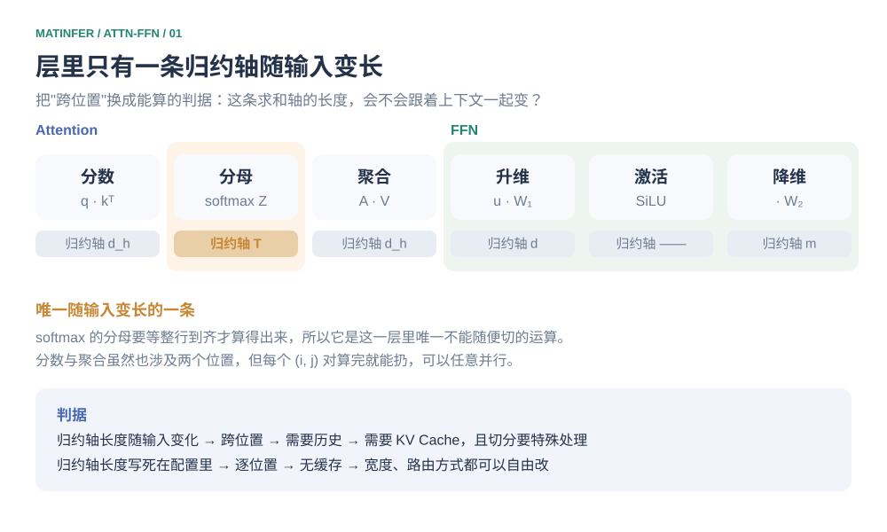
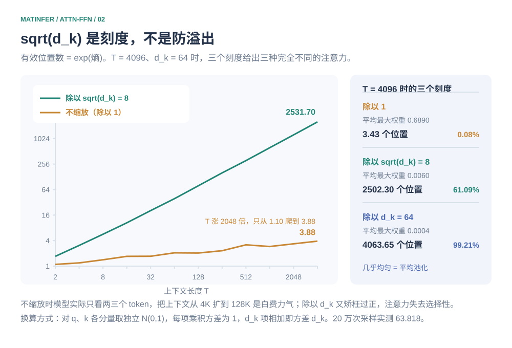
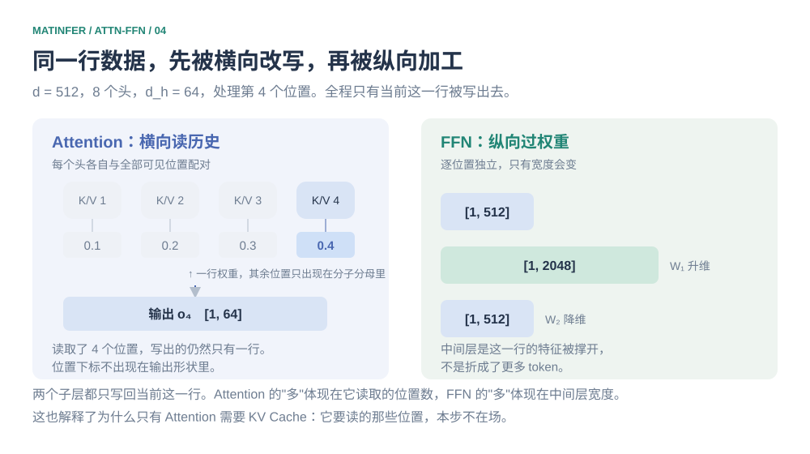
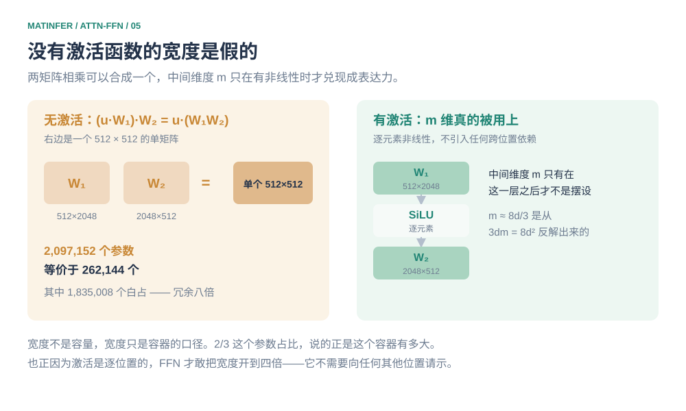
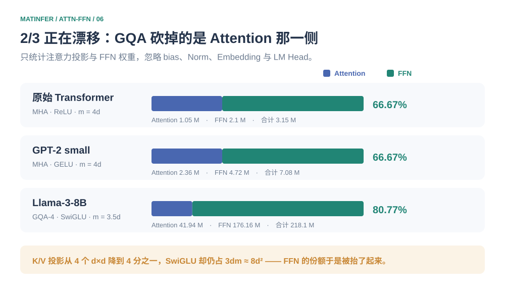

# 名字最响的那个子层参数最少：Attention 与 FFN 的分工从哪来

看一个 8B 模型的某一层。注意力那四块投影矩阵加起来 41.94M 个参数，前馈网络（Feed-Forward Network，**FFN**）的三个矩阵是 176.16M——四倍多，占这一层权重的 80.77%。

而这一层里所有关于"难"和"贵"的叙事全都归前一个。$O(T^2)$ 是它，FlashAttention 是它，KV Cache 是它，长上下文是它，连名字都叫 Attention。占八成参数的那一个，没有缓存，没有以它命名的 kernel 论文，多数人只记得一句"哦，就是那个 FFN"。

2021 年 Geva 等人在《Transformer Feed-Forward Layers Are Key-Value Memories》的引言第一句就摆出了原始配置下的同一个比例（$4d^2$ 对 $8d^2$，恰好 $2/3$），用来说明一件当时没人讲清的事：**占绝对多数的参数，功能最不清楚。**

这个错位不是巧合，也用不着当成偏见去纠正。它来自一条很窄的约束，窄到一句话能说完：

> 整层里只有一处运算需要把同一行上的所有位置凑到一起，就是 softmax 沿 Key 轴的那个分母。

下面只做一件事：把这条约束当成唯一的根，看它能长出多少东西来——包括那些看上去跟它毫无关系的部分。

## 三个位置，一行输出

自注意力（self-attention）里的 $Q$、$K$、$V$ 不是三份不同的数据，而是同一份序列表示 $Z$ 经过三个不同投影得到的：$Q=ZW_Q$、$K=ZW_K$、$V=ZW_V$。所谓"自"，说的是查询方和被查询方是同一段文本——模型在拿序列的一部分去匹配它自己的另一部分。整个动作写成一条式子：

```math
\operatorname{Attention}(Q,K,V)=\operatorname{softmax}\left(\frac{QK^{\mathsf T}}{\sqrt{d_k}}\right)V .
```

三块各管一件事。$QK^{\mathsf T}$ 算出每一对位置之间的**相关性**，softmax 把这条相关性轴归一化成一组权重，最后用权重对 $V$ 做**加权求和**。

这里有一处值得停一下：那组权重并不是参数，它是这一层的输入现算出来的，换个输入就换一份。$W_Q,W_K,W_V$ 只决定拿什么去比，不决定比出来的结果是什么——**按当前输入自动决定该关注哪些位置**，正是它和卷积、全连接最本质的差别：那些算子的权重是训练完就固定的常数，注意力的权重是数据的函数。

不举例子容易看空。取三个位置、每头 $d_h=2$，只看第 2 行。

分数取 $s_{21}=0$、$s_{22}=\ln 6$、$s_{23}=\ln 3$。取对数是为了让指数项落回整数，中间的量才好手算：

```math
e^{s_{2j}}=[1,\,6,\,3],\qquad Z_2=1+6+3=10,\qquad a_2=\left[\tfrac{1}{10},\ \tfrac{6}{10},\ \tfrac{3}{10}\right].
```

三个 Value 取 $v_1=[1,0]$、$v_2=[0,1]$、$v_3=[1,1]$，于是

```math
o_2=0.1\cdot[1,0]+0.6\cdot[0,1]+0.3\cdot[1,1]=[0.4,\ 0.9].
```

这个数的来路值得盯住：**它同时用到了 $v_1$、$v_2$、$v_3$ 三个位置。** 把 $v_3$ 改成 $[1,2]$，$o_2$ 立刻变成 $[0.4,1.2]$——位置 3 一动手，第 2 行就跟着动。两个位置之间没有任何中转，相隔一个 token 还是相隔一万个 token，在这张图里都是同一个乘法。

循环网络（Recurrent Neural Network，**RNN**）走的是另一条路：信息沿时间轴一站一站传，远距离依赖要穿过 $O(n)$ 次变换，梯度在途中被反复缩放。这是当年自注意力能取代 RNN 的直接原因——它没有把长距离依赖"算得更准"，而是把它从一条链子换成了全连接。

## 同一个数进了 FFN，位置就不见了

现在让同一个 $u_2=o_2=[0.4,0.9]$ 走进 FFN。取 $W_1$（$2\times4$）、$W_2$（$4\times2$），激活用 ReLU：

```python
u2 @ W1  = [0.4, 0.9, 0.4, 0.9]    # W1 = [[1,0,1,0],[0,1,0,1]]
ReLU     = [0.4, 0.9, 0.4, 0.9]    # 全是正的，原样通过
@ W2     = [0.8, 1.8]              # W2 = [[1,0],[0,1],[1,0],[0,1]]
```

$[0.8,\,1.8]$ 这个结果**只由 $u_2$ 决定**。位置 1 和位置 3 的表示怎么改都影响不到它——它们根本不在这几次乘法里。

这个 $[0.8,\,1.8]$ 随后会与位置 2 进层时的那份表示相加（残差连接 $\mathbf{x}+\mathbf{y}$），再交给下一层。也就是说上面两段算出来的都不是本层的最终输出，只是它被改写的那一部分——而改写分两步：先被别的位置改写，再被自己这一列的权重改写。

刚才那两个数，来路完全不同：一个要三个位置到齐，一个只要自己那一行。那么"三个"里的三是固定的吗？当然不是，它就是上下文长度 $T$。所以那句约束值得换成一个能算的判据：**这段运算里，有没有一条归约轴的长度会随输入变化。**

## 拿它把整层过一遍

$QK^{\mathsf T}$ 里的每个元素是 $q_i\cdot k_j=\sum_{u=1}^{d_h}q_{iu}k_{ju}$——它确实同时用到两个位置，但那条求和轴是 $d_h=2$，配置里写死的常数；而且每个 $(i,j)$ 对算完就能扔掉，任意切分都能并行。真正随输入变长的是 softmax 的分母 $Z_i=\sum_{j\le i}\exp(s_{ij})$：这条轴是 $j$，长度等于可见位置数，**不把整行凑齐就算不出来**。

FFN 那边逐项检查——$uW_1$ 沿 $d$ 归约，激活逐元素，$\cdot W_2$ 沿 $m$ 归约，全是常数，位置之间零通信。

于是整层里随输入变长的归约轴**只有一条**。



*图 1　把"跨位置交互"换成"变长归约轴"之后，判据从模糊变成可算：整层里只有 softmax 的分母满足它。*

这条路线的工程代价全压在那一处。仓库里那篇 [Online Softmax](../../03-operators/attention/online-softmax.md) 讲的就是它：分块算分数、用局部最大值和局部指数和滚动维护一个"暂时不等分母"的状态，最后统一校正。那条路线之所以存在，正是因为层里只有这一处不能随便切。

不过刚才那句判据里有个限定词："随输入变长的"。$q\cdot k$ 里那条 $d_h$ 轴是定长的，它不带来缓存，也不带来 $O(T^2)$，看上去可以放过去——但它另有笔账，记在缩放因子上。

## 那个 √d_k

$\sqrt{d_k}$ 常被解释成"防止内积过大导致上溢"。这个说法不准确——softmax 自己会先减去最大值，溢出本来就不会发生。它真正控制的是另一件事：**softmax 有多锐**，而这个锐度是由 $d_h$ 定下来的。

先把它的来历算清楚。若 $q$、$k$ 的各分量独立、均值 0、方差 1，那么每一项 $q_uk_u$ 的方差是 1，$d_k$ 项相加后方差就是 $d_k$：

```math
\operatorname{Var}\!\left(\sum_{u=1}^{d_k}q_uk_u\right)=d_k,\qquad \operatorname{std}\!\left(q\cdot k\right)=\sqrt{d_k}.
```

实测过：$d_k=64$ 采样 20 万次，得方差 63.818、标准差 7.9886，与理论值 8 对得上。

除以 $\sqrt{d_k}$ 就是把方差压回 1——**这是一次方差归一化，和 [归一化专题](../normalization/README.md) 里 LayerNorm 除以标准差是同一个动作**，区别只在归约轴：LayerNorm 归一化特征轴，这里归一化的是分数轴。

不除会怎样？算一个能直接比较的量。定义**有效位置数**为 $\exp(H)$，$H$ 是注意力分布的熵：均匀分布时它等于 $T$，全部压在一个位置上时它等于 1。取 $d_k=64$、$T=4096$：

| 除以 | 平均最大权重 | 有效位置数 | 占可见位置 |
| --- | --- | --- | --- |
| $1$（不缩放） | 0.6890 | 3.43 | 0.08% |
| $\sqrt{d_k}=8$ | 0.0060 | 2502.30 | 61.09% |
| $d_k=64$（忘了开根号） | 0.0004 | 4063.65 | 99.21% |

三个刻度，三种命运。不缩放时模型实际只在看两三个 token；按 $\sqrt{d_k}$ 缩放在看六成；除以 $d_k$ 则几乎均匀，退化成平均池化，注意力失去选择性。

## 一条曲线，看出它在管什么

但真正惊人的是曲线的**形状**，不是某个点上的值：

| 上下文长度 $T$ | 2 | 8 | 64 | 512 | 4096 |
| --- | --- | --- | --- | --- | --- |
| 不缩放的有效位置数 | 1.10 | 1.41 | 2.06 | 3.18 | 3.88 |
| 除以 $\sqrt{d_k}$ | 1.70 | 5.66 | 39.12 | 309.03 | 2531.70 |

$T$ 涨了 2048 倍，不缩放的有效位置数只从 1.10 爬到 3.88——**几乎是一条水平线**。这时候把上下文从 4K 扩到 128K 是白费力气，模型永远只看得到两三个 token。而除以 $\sqrt{d_k}$ 之后这条线跟着 $T$ 一起涨，并且稳定在一个**固定比例**上：$T\ge 64$ 之后一直在 60% 到 62% 之间，且这个比例与 $d_k$ 无关（$d_k=128$ 时同样是 61% 到 62%）。



*图 2　有效位置数对上下文长度的曲线。不缩放那条几乎水平，"扩上下文"对它无效；正确的缩放让注意力始终覆盖全部可见位置的固定比例。*

把同一个结论画成分布的样子更直观：固定一组 $q$ 与随机 $K$，只改上下文长度，看权重落在哪些位置。



*图 3　四帧动画（T = 16 / 64 / 512 / 4096）。柱高是降序排列的注意力权重分段，每帧内各自归一。不缩放时总有一根柱子吃掉大半权重，其余贴着基线；正确缩放后权重摊到一整排，覆盖的可见位置比例稳定在六成左右。*

所以 $\sqrt{d_k}$ 不是一条调参经验，它是把 softmax 的锐度钉死在一个与 $d_k$ 无关的刻度上。这解释了为什么换了 RoPE、加了 QK-Norm 之后缩放因子还要重新校——你动的是这个刻度本身。（QWen 那类做法把 RMSNorm 直接加在 $q$、$k$ 上，效果上就是把静态刻度换成了一个由数据决定的动态刻度。这是个推断，论文没有这么表述。）

## 缓存只长在一边

归约轴判据给出的第一个直接推论：**跨位置的运算需要历史，逐位置的运算不需要。**

Attention 要算 $Z$，就得让位置 $j$ 的 $k_j$ 在场，历史越远需要的越久——这就是 KV Cache 存在的全部原因。FFN 则对本步输入那一行之外的任何东西都没有需求，所以它没有缓存，MoE 也不需要。

把一次 decode 的形状写具体。取 $d=512$、8 个头、每头 $d_h=64$，处理第 4 个位置：

| 步骤 | 形状 | 读到几个位置 |
| --- | --- | --- |
| $q$（单头） | $[1,\ 64]$ | — |
| $K$、$V$（可见的历史） | $[4,\ 64]$ | 4 |
| 分数、权重 | $[1,\ 4]$ | 4 |
| 输出（单头） | $[1,\ 64]$ | — |
| 8 头拼接后过 $W_O$ | $[1,\ 512]$ | — |
| FFN | $[1,\ 512]\to[1,\ 2048]\to[1,\ 512]$ | 1 |

**读了 4 个位置，写回去的仍然只有当前这一行。**



*图 4　同一次前向的两段。Attention 的"多"体现在它读取的位置数，FFN 的"多"体现在中间层宽度；两者写回的都是一行。*

代码上只有两处值得点出来，一是当前 K/V 要追加进缓存而不是重建整个张量，二是 softmax 的分子分母都只涉及当前这一行：

```python
k = torch.cat([cache_k, k_t], dim=0)      # 只追加，不重算历史
v = torch.cat([cache_v, v_t], dim=0)
s = q_t @ k.T / math.sqrt(d_h) + mask     # [1, T]
a = torch.softmax(s, dim=-1)               # 唯一跨位置的一步
o = a @ v                                  # [1, d_h]
```

prefill 与 decode 的差别在形状而不在原理：prefill 一次处理 $S$ 个已知位置，权重逻辑上是 $[S,S]$，多个位置一起算；decode 每次只有 $[1,T]$。FlashAttention 一类实现之所以能在显存里不物化完整的 $S\times S$ 矩阵，靠的正是把图 1 那条归约轴分块——和本文的出发点是同一件事。

顺便回答一个必然会被问的问题：FFN 根本不读历史，为什么还能"处理上下文"？因为它处理的是**已经被改写过的行**。进入 FFN 的那个 $u$ 不是原始 embedding，而是在 Attention 里被历史 K/V 加权改写过的表示。逐位置处理不等于没有上下文，只是把"取上下文"和"用上下文"分给了两个子层。

## 谁是大头

既然一个要读 $T$ 个位置、一个只读一行，那就该算一笔账：同一套配置下，单 token decode 时 Attention 的乘加量是 $2hTd_h=1024T$（8 头合计），FFN 是 $2dm=2{,}097{,}152$。令两者相等：

```math
2hTd_h=2dm\quad\Longrightarrow\quad T^\*=\frac{dm}{hd_h}=\frac{512\times2048}{8\times64}=2048.
```

$T=512$ 时 Attention 只占 FFN 的四分之一，要到 2048 才打平。而原始 Transformer 的上下文长度恰好是 512——在那个配置下 FFN 是算力大头，Attention 是访存大头。

**两者瓶颈类型不同，所以"谁的参数多谁更慢"这个推理从一开始就不成立。** FFN 的算术强度高、形状规整，跑满算力就行；Attention 要按 $T$ 读取 KV，$T$ 一大就掉进访存墙。这也是仓库里 [高性能 Backend](../../04-backends/README.md) 与 [Kernel 编程](../../05-kernel-engineering/README.md) 分开成两层的原因——它们要用完全不同的手段优化。

## 逐位置买到了什么

一个子层如果能保证"位置之间零通信"，它就获得了一种自由：随便换。而一个必须凑齐全行的子层没有这种自由。这条自由后来被兑现了三次。

**第一次是宽度。** FFN 把中间层开到四倍，依据是什么？因为**没有激活函数的宽度是假的**。

设 $W_1\in\mathbb{R}^{d\times m}$、$W_2\in\mathbb{R}^{m\times d}$，中间不加任何非线性，则

```math
(uW_1)W_2=u\,(W_1W_2),
```

右边是一个 $d\times d$ 的**单矩阵**。取 $d=512$、$m=2048$：两个矩阵合起来 $2{,}097{,}152$ 个参数，在功能上只等价于一个 $512\times512$ 矩阵的 $262{,}144$ 个——**$1{,}835{,}008$ 个是白占的**。

宽度不是容量，宽度只是容量的**容器**；只有中间插进一层逐元素非线性，这个容器才装得下东西。

而逐元素非线性恰好是逐位置的，不引入任何跨位置依赖，所以宽度可以放心往大开。它的基本形式就是两层全连接夹一个激活：原版 Transformer 取 $\phi=\operatorname{ReLU}$（即 $\max(0,z)$）、$m=4d$，此时写成 $\operatorname{FFN}(u)=\max(0,\,uW_1+b_1)W_2+b_2$。



*图 5　同样的两个矩阵，中间不插非线性就能合成一个，$m$ 维形同虚设；插进去之后宽度才兑现成表达力。*

**第二次是门控。** 现代模型把这里换成了门控线性单元（Gated Linear Unit，**GLU**）家族，主流是 SwiGLU：两条输入投影，一条过 SiLU 当门，再逐元素相乘，最后投影回来。

```math
\operatorname{FFN}_{\mathrm{SwiGLU}}(u)=\big[\operatorname{SiLU}(uW_g)\odot(uW_u)\big]W_d,\qquad \operatorname{SiLU}(z)=\frac{z}{1+e^{-z}}.
```

三个矩阵，所以宽度的取法变了。要让它和传统两层 FFN 的参数预算对齐，需 $3dm\approx8d^2$，即 $m\approx 8d/3\approx2.67d$。Llama-3-8B 实际取 3.5（$14336/4096$），是为了对齐 256 的倍数往上取整。**这个数不是随手挑的，它是从 $8d^2$ 这个预算反解出来的。**

顺带纠一处常见的串台：GELU 是 BERT、GPT-2 那一代的选择，原版 Transformer 用的是 ReLU，今天的主流大模型用的是 SwiGLU。"现代 Transformer 常用 GELU"这句话大概停在 2020 年。

**第三次是 MoE。** 如果归约轴判据只解释了一件事，那它至少解释了今天最大的一次架构迁移：为什么 MoE 只替换 FFN。因为 FFN 是逐位置的，每个 token 本来就可以独立决定自己走哪几个专家，这个决定不牵动任何其他 token，跨位置的语义完全不受影响。反过来，如果去改 Attention，等于在动"哪些 token 一起被算"这件事——softmax 的分母恰恰要求同一行的位置全都到齐，路由一改分母就变了，整行的归一化语义跟着变。这不是不能做，是代价高得多。细节见 [DeepSeekMoE 专题](../moe/README.md)。

## 那八成参数在干什么

回到开场那个问题。既然 FFN 逐位置、没有缓存、参数却最多，它到底存了什么？

Geva 那篇论文给了一个很直接的说法：FFN 的 $m$ 个神经元本来就是 $m$ 个键值对——$W_1$ 的每一行是一个键，负责匹配输入模式；$W_2$ 的对应列是一个值，负责给出输出分布。dense FFN 只是把这些键值对**全部**用上了，每个都参与，各带一个激活值当权重。既然结构上就是键值检索，那把"全部用"改成"挑几个用"就是一个很自然的动作。

Zhang 等人在 2022 年前后做的 MoEfication 实验给了它一个经验支撑：只保留 10% 到 30% 的神经元，还能保住 95% 以上的性能——稀疏性本来就在那里，MoE 只是把它显式化了。

所以这一层里，**Attention 负责把相关的历史搬到当前位置，FFN 负责在当前位置做判断**——而其中大部分判断是查表。搬运要处理长度 $T$，所以难、所以贵、所以有那么多并行方案；查表的形状是固定的，所以每一步便宜、但因为要存的键值对数量庞大，参数最多。

## 口诀该怎么理解

到这里可以处理一个流传很广的说法："Attention 主要是线性变换加 softmax，非线性弱，要靠 FFN 补非线性。"

它有三处站不住。第一，$QK^{\mathsf T}$ 是双线性（bilinear）的——分数由两个输入共同决定，不是一组固定权重，这已经超出"线性变换"的范围。第二，softmax 不是温和的非线性：上面那张曲线就是证据，它的有效支撑集能从 3 个位置跨到 2500 个位置，变化幅度比 ReLU 激烈得多。第三，"权重固定时 $AV$ 对 $V$ 线性"虽然对，但它说的是一个不存在的场景——真实推理里权重永远是刚刚算出来的。

正确的区分不是非线性**强弱**，而是非线性**作用在哪根轴**。Attention 的非线性是归一化型的，作用在 Key 轴上，把不同位置的信息在算子层面混叠到一起；FFN 的非线性是逐元素型的，作用在特征轴上，位置之间毫无往来。前者改变了"信息从哪来"，后者改变"信息长什么样"。

于是"沟通"和"思考"这两个词可以落到实处：**沟通 = 把相关的历史搬到当前这一列，思考 = 在每一列上独立地查表和变换。** 一层等于这两件事各做一次，缺一不可——只沟通不思考，信息搬来却不变换；只思考不沟通，每一列都只能看见自己。

## 一行权重

开场说，所有关于"难"和"贵"的叙事都归了 Attention。而那条路径上唯一能直接看见的东西，是这一行数字——当前 token 把注意力分给了谁。早年有很多工作拿它当解释，直到 Jain 与 Wallace 在 2019 年写了《Attention is not Explanation》：权重大小与特征重要性并不必然一致，而且能构造出注意力分布完全不同、最终输出却几乎一样的反例。

所以这一行的正确用法是观测而不是归因。它能告诉你这个头在这一层读了哪些位置，不能告诉你模型为什么这么预测——后面还有输出投影、残差、FFN 和十几层结构在工作。**可观察不等于可解释**，这句话在 attention 上比在别处更该记住。

## 回看

$2/3$ 这个数字正在失效，原因不在 FFN，在 Attention 那边被砍了。多头注意力（Multi-Head Attention，**MHA**）的四个投影都是 $d\times d$，合计 $4d^2$；分组查询注意力（Grouped-Query Attention，**GQA**）让多个 Query 头共享一组 K/V 头，$W_K$、$W_V$ 的尺寸随之掉到 $d\times(n_{kv}d_h)$。

Llama-3-8B 用 32 个 Query 头对 8 个 KV 头，K/V 投影的参数掉到四分之一，而 SwiGLU 那三个矩阵仍旧维持 $3dm\approx8d^2$。两头一夹：

| 配置 | Attention 参数 | FFN 参数 | FFN 占比 |
| --- | --- | --- | --- |
| 原始 Transformer（MHA，ReLU，$m=4d$） | 1.05 M | 2.10 M | 66.67% |
| GPT-2 small（MHA，GELU，$m=4d$） | 2.36 M | 4.72 M | 66.67% |
| Llama-3-8B（GQA-4，SwiGLU，$m=3.5d$） | 41.94 M | 176.16 M | **80.77%** |



*图 6　三个配置的注意力投影与 FFN 权重占比。前两行的 $m=4d$ 与 MHA 组合恰好给出 2/3；Llama-3-8B 换成 GQA 与 SwiGLU 之后抬到 80.77%。*

所以开场那个错位还在加深：名字最响的那块越来越小，不做声的那块越来越大。但记住结论不如记住那条约束——**只有一处运算要把整行凑齐**。它让 Attention 必须跨位置，于是有了 $\sqrt{d_k}$ 这个刻度、有了 KV Cache、有了长上下文下的访存墙；它没有约束 FFN，于是 FFN 可以逐位置独立，可以放心开到四倍宽，可以被 MoE 整个换掉，可以在参数表里占到八成而仍然不是长上下文里的瓶颈。

如果面试里要讲这件事，别从"Attention 做什么、FFN 做什么"开始——那是结论。从一笔账开始：**同一层里，注意力要读 $T$ 个位置，FFN 只读一行，可后者占了八成参数。** 然后往下推：为什么缓存只长在一边、为什么 $\sqrt{d_k}$ 不能省、为什么 MoE 只敢换 FFN。推到这些地方，分工自然就出来了。

## 附录　面试速查

下面三条是面试里最常被追着问、也最容易答偏的。正文都给过依据，这里只留最短的答法。

**Query 只有一行，为什么能读到很长的上下文？**

Query 的数量决定本步要输出多少行，Key/Value 的数量决定每行能看到多少位置。$[1,d_h]$ 的 $q$ 与 $[T,d_h]$ 的 $K$ 点积得 $[1,T]$，加权 $[T,d_h]$ 的 $V$ 仍得 $[1,d_h]$。

**为什么 $\sqrt{d_k}$ 不能换成 $d_k$，误差很大吗？**

很大，而且方向相反。$d_k=64$、$T=4096$ 时，正确缩放下有效位置数是 2502（六成），除以 $d_k$ 则涨到 4064（99.2%）——注意力退化成平均池化，选择性没了。

**注意力权重能当解释用吗？**

能当观测，不能当归因。Jain 与 Wallace 2019 构造过注意力分布不同而输出几乎相同的反例，权重与特征重要性不必一致。

## 参考与关联专题

- [Attention Is All You Need](https://arxiv.org/html/1706.03762v7)：自注意力、缩放点积、逐位置 FFN 与原始配置。
- [Transformer Feed-Forward Layers Are Key-Value Memories](https://aclanthology.org/2021.emnlp-main.446/)：$4d^2$ 与 $8d^2$ 的分账，以及 FFN 作为键值记忆。
- [GLU Variants Improve Transformer](https://arxiv.org/html/2002.05202v1)：门控 FFN 与 $m\approx8d/3$ 的参数匹配。
- [MoEfication: Transformer Feed-forward Layers Are Mixtures of Experts](https://aclanthology.org/2022.findings-acl.79/)：只保留 10%~30% 神经元仍保住 95% 以上性能。
- [Attention is not Explanation](https://aclanthology.org/N19-1357/)：注意力权重作为解释的局限。

[Online Softmax](../../03-operators/attention/online-softmax.md) · [DeepSeekMoE](../moe/README.md) · [归一化专题](../normalization/README.md) · [返回 Transformer 基础](README.md) · [返回模型原理](../README.md)
