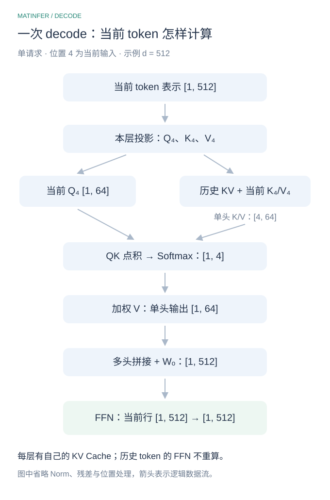
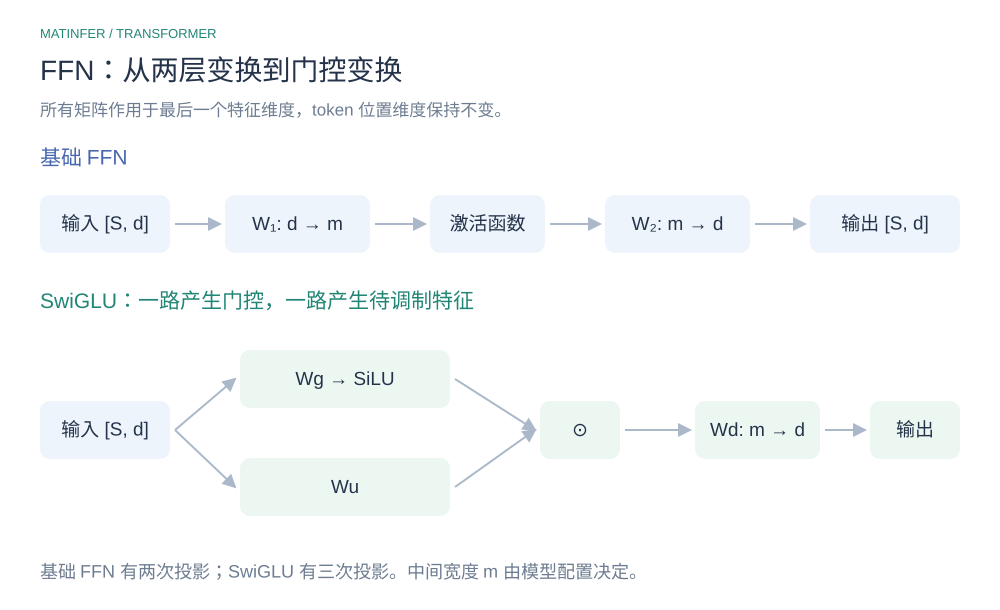

# Attention 与 FFN：Transformer 的两个子层怎样分工

> Attention 和 FFN 都会更新 token 的表示，但它们混合的是不同维度：**Attention 在可见位置之间聚合信息，FFN 在每个位置内部变换特征。** 先把这两个过程区分清楚，再看公式、参数量与推理行为。

## 1. 从同一个输入，看两种不同的数据流



*图 1　左侧以位置 3 为例，展示因果 Attention 的可见范围；右侧展示 FFN 的逐位置计算。这里省略了多头、Norm 和残差，突出两个子层的分工。*

> 忽略批次维度，输入 X 的形状是 `[S, d]`：S 行对应 S 个 token，每行 d 个特征。Attention 可以把不同的行联系起来；FFN 对每行应用同一个函数，改变这一行的特征表示，输出仍是 `[S, d]`。

> “每个位置独立做 FFN”有两个边界：它不直接读取别的位置来计算当前输出，但各位置共享同一套参数；它的输入可能已经通过上一段 Attention 包含上下文，不能把它理解成只处理最初的单词嵌入。

## 2. Attention：根据输入决定怎样聚合上下文

> 自注意力中，Q、K、V 都由同一个输入序列经过不同投影得到。Q 用于产生查询，K 用于与查询计算匹配分数，V 提供实际参与聚合的内容。对一个注意力头，可以写成：

```math
Q=XW_Q,\qquad K=XW_K,\qquad V=XW_V.
```

```math
A=\mathrm{Softmax}\left(\frac{QK^{\mathsf T}}{\sqrt{d_h}}+M\right),
\qquad O=AV.
```

> Q、K 的形状分别是 `[S, dₕ]`，V 是 `[S, dᵥ]`；分数与权重矩阵是 `[S, S]`，输出 O 是 `[S, dᵥ]`。Softmax 沿每个 Query 对应的 Key 位置计算。M 是掩码：允许的位置加零，禁止的位置加负无穷，使其权重为零。这里假设每行至少有一个可见位置。[^transformer]

> 对位置 i，输出是所有可见位置 Value 的加权和。比如三个可见位置的权重为 `[0.1, 0.2, 0.7]`，输出就是 `0.1V₁ + 0.2V₂ + 0.7V₃`。权重不是所有输入共用的固定参数，它们由当前 Q、K 动态计算。

### 全局依赖，必须说明可见范围

> 双向全局自注意力允许一个位置直接读取所有未屏蔽的位置；标准因果自注意力只允许读取自己及之前的位置。滑动窗口等变体还会进一步限制范围。因此“任意两个位置都直接交互”并非所有 Attention 的共同性质。

> 相比按时间步传递状态的 RNN，全局自注意力缩短了远距离信息交互的路径。但建立直接连接不等于模型一定能正确利用长距离信息，也不能简单描述成已经解决了所有长距离依赖问题。[^transformer]

### Attention 不是整体线性函数

> 若把 A 固定，`AV` 对 V 是线性的；实际自注意力里，A 本身依赖 X，包含 QK 点积和 Softmax，整个映射不是线性的。因而不能把 Attention 与 FFN 区分成“前者缺少非线性，后者才提供非线性”。它们的主要差别是计算结构与混合维度。

### 并行计算不等于并行生成所有未来 token

> Prefill 时输入 token 已知，多个位置可以一起计算，即使使用因果 Mask 也不需要逐个位置运行 Attention。自回归 Decode 时，下一步输入依赖上一步生成结果，生成步骤之间仍有依赖；一步之内的头、请求与矩阵计算可以并行。

### 注意力图能显示什么

> 权重图可以帮助观察某层某头怎样分配聚合权重，但不能直接当作最终预测的因果解释。Value 的内容、输出投影、残差以及后续层都会参与结果，高权重不自动等于对最终输出最重要。[^explanation]

## 3. FFN：对上下文表示做逐位置特征变换



*图 2　基础 FFN 先扩展特征，再非线性变换并投影回来；SwiGLU 引入两路输入投影和逐元素门控。图中两种 FFN 的 m 不必相同。*

> 基础 FFN 对每个位置的向量 x 使用相同的两层变换：

```math
\mathrm{FFN}(x)=\phi(xW_1+b_1)W_2+b_2,
\qquad W_1\in\mathbb{R}^{d\times m},\quad
W_2\in\mathbb{R}^{m\times d}.
```

> φ 可以是 ReLU 或 GELU。ReLU 把负值置零、保留正值；GELU 使用平滑的输入相关调制。原始 Transformer 使用 ReLU，设置 m＝4d，例如 `512 → 2048 → 512`；这是具体配置，不是 FFN 的定义要求。[^transformer]

### 为什么不能只有两个线性层

> 忽略 bias，若中间没有激活函数，`(xW₁)W₂ = x(W₁W₂)`，两个矩阵可以合成一个矩阵。即使加上 bias，两个仿射变换的复合仍然是仿射变换。中间的非线性使 FFN 能表达无法由一次固定线性投影替代的函数。

> 中间维度 m 为特征组合提供更宽的表示空间，激活函数或门控根据输入改变响应，再把结果投影回 d 维以适配残差相加。这是增加模型表达能力与参数容量的一个重要组成部分，不能把“升维”本身理解成必然提炼出更好的特征。

### SwiGLU：一路门控，一路提供特征

> 门控 FFN 是另一种常见设计。省略 bias，SwiGLU 可以写成：

```math
\mathrm{FFN}_{\mathrm{SwiGLU}}(x)
=\left[\mathrm{SiLU}(xW_g)\odot(xW_u)\right]W_d,
\qquad \mathrm{SiLU}(z)=\frac{z}{1+e^{-z}}.
```

> Wg、Wu 的形状都是 `[d, m]`，Wd 是 `[m, d]`。一路投影经过 SiLU，与另一条投影逐元素相乘，再映射回来。这个门控会随当前输入改变；它不是在 token 之间重新计算 Attention。[^glu]

> 标准两层 FFN 有两个主要矩阵，SwiGLU 有三个。若希望两者主要权重参数量接近，传统 m＝4d 的两层 FFN 对应 `8d²`，SwiGLU 则可选择 m 约为 `8d/3`，使 `3dm ≈ 8d²`。实际宽度可能为硬件对齐等要求取整，并由模型配置决定。[^glu]

## 4. FFN 参数约占 2/3，这句话怎么算

> 先限定一个传统配置：标准 MHA，Q、K、V、O 各有一个 `[d, d]` 投影；两层 dense FFN 的中间维度是 4d。忽略 bias、Norm、Embedding 与 LM Head，则：

```math
P_{\mathrm{Attention}}=4d^2,\qquad
P_{\mathrm{FFN}}=d(4d)+(4d)d=8d^2.
```

```math
\frac{P_{\mathrm{FFN}}}{P_{\mathrm{Attention}}+P_{\mathrm{FFN}}}
=\frac{8d^2}{4d^2+8d^2}=\frac{2}{3}.
```

> 所以准确说法是：**在上述配置下，FFN 占 Attention 和 FFN 这两部分主要权重参数之和的 2/3。** d＝512 时，Attention 为 1,048,576 个参数，FFN 为 2,097,152 个参数。

> GQA 会减少 K/V 投影参数，SwiGLU 改变矩阵数量，MoE 又引入多个专家，因此不能把 2/3 当成所有模型的固定比例。参数占比也不等于延迟占比：Attention 的计算和缓存读取随序列长度变化，Prefill 与 Decode 的瓶颈可能不同。

> FFN 中存在知识存储与输入相关计算的研究现象，但仅凭参数多，不能判定它是模型“记忆”或“推理”能力的唯一或主要来源。模型行为由子层、残差和多层组合共同形成。

## 5. 怎样描述两者关系才准确

| 比较项 | Attention | FFN |
| --- | --- | --- |
| 直接混合的维度 | 可见 token 位置；也有特征投影 | 单个 token 内部的特征维度 |
| 是否直接读取其他位置 | 在 Mask 允许的范围内读取 | 逐位置计算，不直接跨 token 读取 |
| 输入相关性 | 聚合权重由当前 Q、K 计算 | 激活响应与门控随当前位置输入变化 |
| 非线性 | 整体映射包含点积与 Softmax 等 | 包含激活函数，门控形式还包含逐元素乘积 |
| 参数共享 | 投影参数在位置之间共享 | 同一 dense FFN 参数在位置之间共享 |

> 可以用“Attention 沟通、FFN 加工”帮助记忆，但不把它当作模型心理活动的解释。对于本文讨论的标准 Transformer Block，二者分别承担上下文聚合与特征变换；完整 Block 还包含 Norm、残差等结构，“Attention＋FFN”只是省略细节的简称。

## 面试与追问

**FFN 不跨 token 计算，为什么还能处理上下文？**

> 因为进入 FFN 的当前位置表示已经可以包含 Attention 聚合来的其他位置的信息。FFN 不直接读取其他行，但会变换这一行已有的上下文表示。

**Attention 已经非线性，FFN 为什么仍有价值？**

> 具有非线性不代表两个计算模块功能相同。Attention 以输入相关权重聚合可见位置，FFN 提供专门的逐位置特征变换与额外参数容量；其价值不能仅用“给模型补一个激活函数”解释。

**FFN 参数更多，能否直接判断它在推理中更慢？**

> 不能。需要看序列长度、批次、精度、模型结构和实现。参数量说明存储规模，不直接决定实际执行时间；Attention 的历史 KV 读取也不包含在投影权重参数量中。

## 参考与关联专题

- [Attention Is All You Need](https://arxiv.org/html/1706.03762v7)：自注意力、因果 Mask、逐位置 FFN 与原始配置。[^transformer]
- [GLU Variants Improve Transformer](https://arxiv.org/html/2002.05202v1)：门控 FFN 与参数量匹配。[^glu]
- [Attention is not Explanation](https://aclanthology.org/N19-1357/)：注意力权重作为解释的局限。[^explanation]

[^transformer]: Vaswani 等，Attention Is All You Need，2017。
[^glu]: Shazeer，GLU Variants Improve Transformer，2020。
[^explanation]: Jain 与 Wallace，Attention is not Explanation，2019。

[返回 Transformer 基础](README.md) · [Attention 专题](../attention/README.md) · [归一化专题](../normalization/README.md) · [返回模型原理](../README.md)
