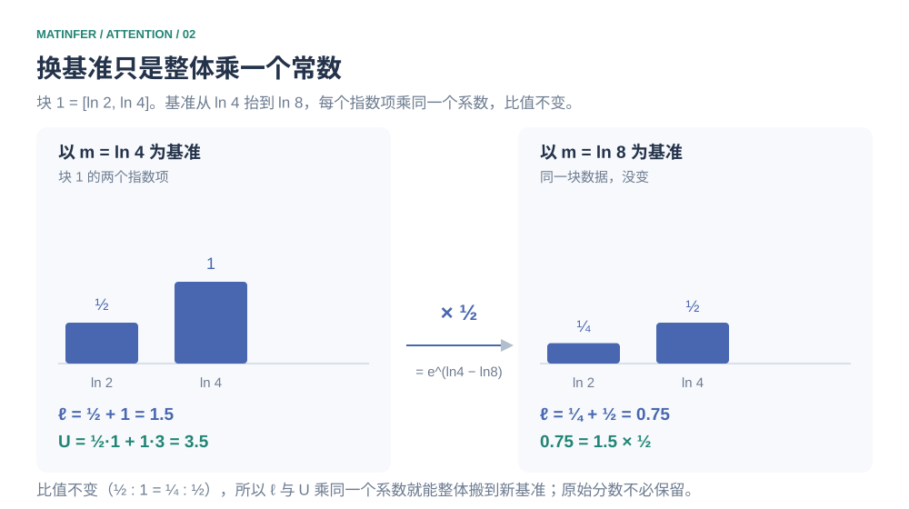
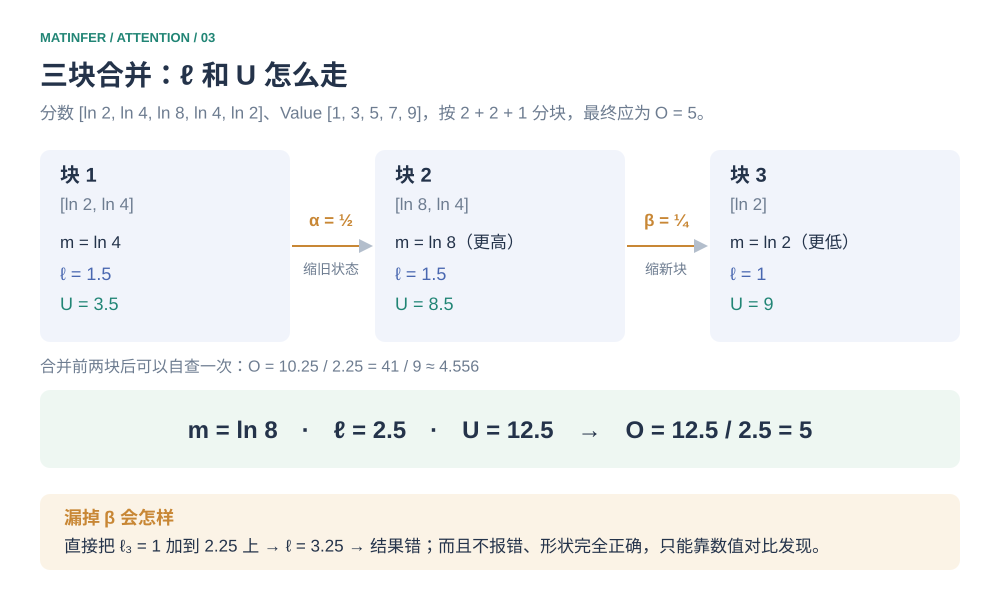
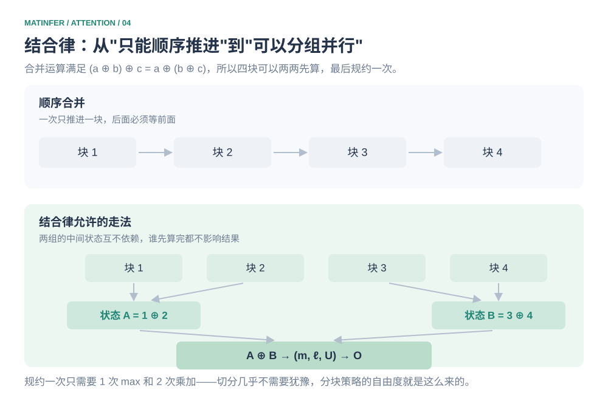
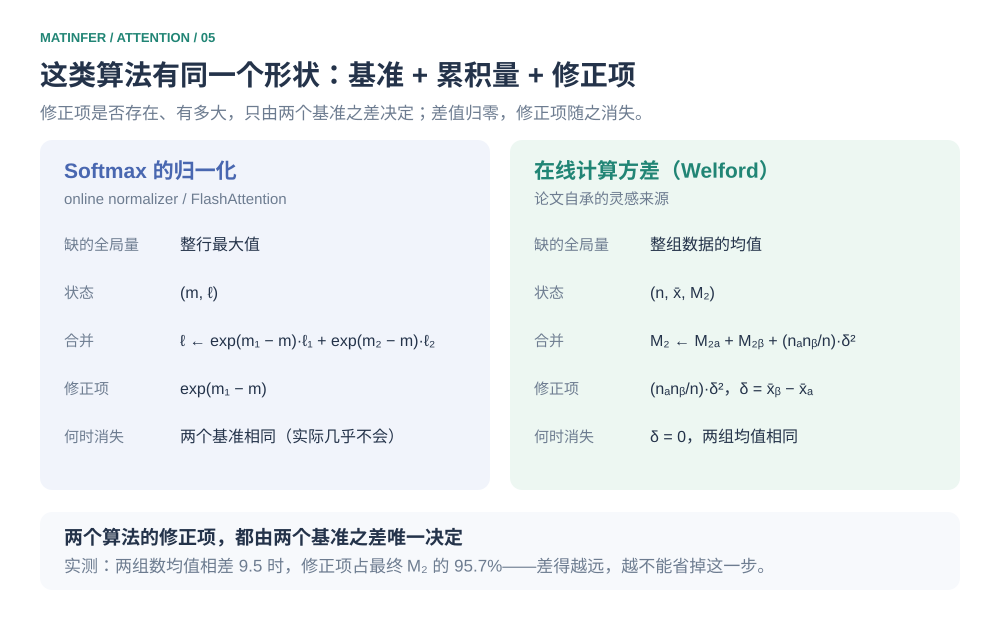

# 为省一次访存而生：Online Softmax 如何无意中成为长上下文的地基

2018 年，NVIDIA 的 Maxim Milakov 和 Natalia Gimelshein 写了一篇四页的论文，《Online normalizer calculation for softmax》。目标小得近乎可笑：Softmax 为了数值稳定必须把输入读两遍，他们想让它只读一遍。省下来的东西，就是一次内存访问。

这篇论文的动机和 Attention 没有任何关系。它关心的是语言模型的输出层——那里 Softmax 要在整个词表上跑一次，后面通常还跟着一个 TopK 用于采样。论文报告的成绩是：Softmax 本体最多快 1.3 倍；如果和 TopK 融进同一个 kernel，最多快 5 倍。1.3 倍在 2018 年算不上新闻。

它当时确实也没引起多少注意。但今天回头看，这篇论文的位置相当特殊：四年后 FlashAttention 用上了同一条递推式的推广版本，"Attention 不必把 N×N 的分数矩阵写进显存"才从一句口号变成可实现的事；再往后，Split-KV、Flash-Decoding、Ring Attention 这些长上下文方案，全都建立在它的一个性质上。

而那个性质，和"省一次访存"毫无关系。

这就是本文要讲的事：一个微小的动机，怎么长出了它从来没打算要的能力。

## 如果让你从零写这个算子

先不看别人的实现。给定一行分数 $x$，要输出 $y_i=e^{x_i}/\sum_j e^{x_j}$，你会怎么写？

你会很快发现这个式子不能直接用。假设这一行里有两个分数，一个是 0，一个是 1000，那么 $e^{1000}\approx1.97\times10^{434}$——这个数超出了任何浮点格式能表示的范围，结果是得到 `inf`，接下来相除得到 `NaN`，整行输出作废。FP16 的容忍度更低：它能表示的最大值是 65504，也就是**只要某个分数超过 $\ln 65504\approx 11.1$，指数就先炸了**。在 FP16 下，一行 logit 相差超过大约 11 就会直接爆掉，这并不是什么罕见情形。

（写这篇文章时我顺手在核对脚本里打了个 `math.exp(1000)` 想看看误差有多大，Python 直接抛了 `OverflowError`。）

所以正确的写法是先求整行最大值，再减掉它：

```math
m=\max_t x_t,\qquad y_i=\frac{e^{x_i-m}}{\sum_j e^{x_j-m}}
```

减完之后最大的那一项恰好是 $e^0=1$，其余都落在 $(0,1]$ 之间，不可能向上溢出；而分子分母同时乘了 $e^{-m}$，这个共同因子会抵消。这一步和"精度"关系不大，它是**让计算在浮点数的范围内成立**的前提。

到这里你的实现大概是三行：求最大值、求指数和、相除。它是对的，也是所有主流框架的默认实现。而它有一个不太显眼的代价——**这一行数据要被读三遍**。第一遍求最大值，第二遍求指数和，第三遍才能输出；加上写回，平均每个元素访问内存 4 次。

在 CPU 上这不是问题。但在 GPU 上，如果数据还在 HBM 里、而 HBM 带宽正是瓶颈，那么这三遍就是三倍的时间。


*图 1　左边是框架默认的三遍读法，右边是 2018 年那篇论文的一遍读法。省下的只有一次访存。*

于是问题变成：**能不能只读一遍，同时给出正确的 Softmax？**

你大概会立刻说不行。不看到最后一个数，你不知道最大值；不知道最大值，就不能安全地取指数。这个"不行"，就是 2018 年之前所有人的答案。而这篇论文推翻的正是它。

## 一条恒等式，和它推翻的东西

关键在于重新看待"最大值"这个量。它看起来是全局信息，但它在公式里其实只干一件事：**当基准**。

设某个分数是 $s$，你已经用 $m_{\mathrm{old}}$ 当基准算出了 $e^{s-m_{\mathrm{old}}}$，然后发现了一个更大的值，要把基准换成 $m_{\mathrm{new}}$。这时

```math
e^{s-m_{\mathrm{new}}}=e^{s-m_{\mathrm{old}}}\cdot e^{m_{\mathrm{old}}-m_{\mathrm{new}}}
```

右边第二个因子只和两个基准有关，**和 $s$ 本身无关**。所以换基准不需要重算每一个指数——所有旧指数一起乘上同一个系数就行。而"所有旧指数之和"你已经有了；直接缩放那个和，就等于把历史上所有数据都搬到了新基准上，原始分数不用再留着。

这就是全部。后面所有内容都是它的推论。写成代码，核心循环只有六行：

```python
m, ell = -float("inf"), 0.0
for blk in blocks:
    m_new = max(m, blk.max())
    alpha = exp(m - m_new)              # 旧状态整体搬到新基准
    ell = alpha * ell + exp(blk - m_new).sum()
    m = m_new
```

抽象地说容易含糊，用一行五个分数走一遍就清楚了。取分数 $s=[\ln 2,\ln 4,\ln 8,\ln 4,\ln 2]$，配上 Value $v=[1,3,5,7,9]$。分数特意写成 $\ln$ 的形式，是为了让指数项落回整数——$e^{\ln2}=2$、$e^{\ln8}=8$——方便手算核对；Value 用标量是为了把加权过程看清楚，真实情形下它常是向量，对每个分量做同样的事。

先一次性算完：指数项是 $[2,4,8,4,2]$，加起来是 20，权重是 $[1/10,2/10,4/10,2/10,1/10]$，输出 $O=5$，是个整数。**记住这个 5，后面每一步都拿它对照。**

现在按 $2+2+1$ 切成三块，假装自己是一块一块读进来的。第一块 $[\ln 2,\ln 4]$ 的块内最大值是 $\ln 4$，减掉它之后指数项是 $[1/2,1]$，于是分母 $\ell_1=1.5$、加权分子 $U_1=\frac12\times1+1\times3=3.5$。

第二块 $[\ln 8,\ln 4]$ 的块内最大值是 $\ln 8$，比当前的 $\ln 4$ 高。按上面那条恒等式，旧状态要整体乘 $e^{\ln4-\ln8}=\frac12$ 才能换到新基准：

```math
\ell=1.5\times\tfrac12+1.5=2.25,\qquad U=3.5\times\tfrac12+8.5=10.25
```

（第二块自己的局部状态是 $\ell_2=1+\frac12=1.5$、$U_2=1\times5+\frac12\times7=8.5$。）此时 $O=10.25/2.25=41/9$，正好是前两块合并后的正确输出 $\frac{1+6+20+14}{9}$，可以自己验一遍。



*图 2　上面那一步在做的事：基准从 $\ln 4$ 抬到 $\ln 8$，每个指数项乘 $1/2$。柱子的高度变了，比值没变——这正是 $\ell$ 和 $U$ 能各自乘一个系数就整体搬家的原因。*

第三块只有一个 $\ln 2$，它的局部最大值**比当前的 $\ln 8$ 小**。这次基准不变，要缩放的反而是新来的那块：乘上 $e^{\ln2-\ln8}=\frac14$，于是 $\ell=2.25+0.25=2.5$、$U=10.25+2.25=12.5$，$O=12.5/2.5=5$。

和一次性算出来的完全一样。



*图 3　三块的局部状态，以及两次合并各自要缩放谁。底部那一条是漏掉 $\beta$ 的后果——它不报错。*

## 有个地方几乎所有人都会写错

上面第三块那一步，最容易漏。块 3 是以 $\ln 2$ 为基准算出来的，基准被抬到 $\ln 8$ 之后，它的全部指数项都要乘 $\frac14$。如果直接把它的 $\ell_3=1$ 加到 2.25 上，会得到 3.25，最终答案就错了。

麻烦的是，这种错误**不会报错，形状也完全正确**——它只会让结果悄悄偏掉，只能靠数值对比发现。而它恰恰是最容易漏的一种，原因很朴素：最大值只会越更新越大，所以"旧状态要缩放"和"新块要缩放"这两种情形，必须先遇到一个更大的块、再遇到一个更小的块，才会各出现一次。**如果测试数据的分块顺序不够"不幸"，其中一种情形根本不会发生。** 只因为这个算法足够简单，人们才敢写完就上线。

这也是本文例子非要切成三块的原因。两块的话，你会发现怎么算都对。



*图 4　把五个状态并排成一次循环。用浏览器直接打开这个 SVG 会自动播放；作为文档里的图片时停在第一帧。*

顺手回答一个必然会被问到的问题：合并公式写成通式是 $\ell_{\mathrm{new}}=\alpha\ell+\beta\ell_b$，看着像要算两个指数。其实永远不用。因为 $m_{\mathrm{new}}=\max(m,m_b)$ 必然等于其中一个，所以 $\alpha$ 和 $\beta$ 每次恰有一个是 1，另一个小于等于 1。真实 kernel 里通常先用更新后的 $m$ 去算当前块的指数，让新块的系数天然等于 1，于是只需要保留旧状态那一个缩放系数——上面那六行代码就是这么写的。

## 为什么恰好是三个数

到这一步你手上有了三个量：当前基准 $m$、基准下的总权重 $\ell$、以及加权到 Value 上的分子 $U$。一个自然的问题是：为什么是三个？两个不行，四个不行吗？

反过来问更好答：**把两段数据合起来的时候，最少需要知道什么？** 需要知道基准是谁，否则换基准时不知道乘多少；需要知道在这个基准下累积了多少权重，否则最后没法归一化；需要知道这些权重加权到 Value 上的结果，否则只有分母没有分子。三个需求，三个量，一个都不能少。多存一个是浪费，少存一个就丢了信息。

用统计的说法，$(m,\ell,U)$ 是这部分数据关于最终输出的**最小充分统计量**。

这里还藏着一个容易混淆的地方：原论文其实只维护了 $(m,\ell)$ 两个量，没有 $U$。因为它处理的是普通 Softmax，只需要归一化统计量。而 Attention 在归一化之后还要拿权重去加权 $V$——这一项是 FlashAttention 补上的。**Online softmax 和 FlashAttention 之间那一年的差距，就是这个 $U$。**

## 动机和后果是两回事

前面一直在按顺序一块一块合并。但这个合并运算比"顺序执行"要强得多——它是一个真正的二元运算，记成 $\oplus$：

```math
(m_1,\ell_1,U_1)\oplus(m_2,\ell_2,U_2)
=\left(\max(m_1,m_2),\ \alpha\ell_1+\beta\ell_2,\ \alpha U_1+\beta U_2\right)
```

其中 $\alpha=e^{m_1-\max}$、$\beta=e^{m_2-\max}$。而它满足结合律：$(a\oplus b)\oplus c=a\oplus(b\oplus c)$。在本文例子上验证就是换一下合并顺序：

| 合并方式 | ℓ | U | O |
| --- | --- | --- | --- |
| `(1 ⊕ 2) ⊕ 3`（文中顺序） | 2.5 | 12.5 | 5.0 |
| `1 ⊕ (2 ⊕ 3)` | 2.5 | 12.5 | 5.0 |
| `3 ⊕ 1 ⊕ 2`（打乱顺序） | 2.5 | 12.5 | 5.0 |
| 块大小 1 / 3 / 5 | 2.5 | 12.5 | 5.0 |



*图 5　上半是"一次只推进一块"，下半是结合律允许的走法：两组的中间状态互不依赖，最后规约一次就够。*

这是整篇文章里最值得记住的一句：**Online Softmax 真正的价值不在"能读一遍"，而在"合并满足结合律"。**

读一遍是它的动机，结合律是它的后果。而后果比动机大得多——大到几乎像是两件不相干的事。

读一遍解决的只是"我能不能不物化那个 $N\times N$ 矩阵"，那是一个省内存的问题。结合律解决的是"我能不能把这些块分给不同的人同时算"，那是一个并行的问题。**分块从"省内存的手段"变成了"并行的依据"，中间隔着一次观察。**

现在再去看那些长上下文方案，会发现它们全是这个后果的展开。FlashAttention 把 KV 沿序列方向切块，各块独立算出局部状态再合并——用的是结合律。Split-KV 和 Flash-Decoding 把长上下文切成多份交给不同 CTA，每份算出一组 $(m,\ell,U)$，最后做一次跨 CTA 的规约——还是这个 $\oplus$，只是搬到了更细的并行粒度上。Ring Attention 在多卡之间传 K/V 块、增量更新输出，用的也还是同一件事。

合并的代价极低这一点也值得记：合并两个状态只需要一次 max 和两次乘加，比重算一整块便宜得多。这意味着切分几乎不需要犹豫——多切几块、最后多合几次，额外开销可以忽略。**分块策略的自由度就是这么来的。**

## 一个反直觉的对照

关于 FlashAttention 快在哪，有个很常见的误解值得澄清：**它并没有少算任何东西。** 分块之后，Q 与 K 的配对计算仍然是 $O(N^2d_h)$——稠密注意力的运算量不会因为分块而下降。

那省的是什么？省的是搬运。标准实现要把 $S$ 写进显存、读回来做 Softmax、写成 $P$、再读回来乘 $V$；分块实现把这些都放在片上 SRAM 里完成，只把最终输出写回去。

这个区分在 2021 年有一个很有说服力的对照。Rabe 和 Staats 用同样的分块 Softmax 说明过 Self-Attention 并不需要 $O(n^2)$ 的显存——但他们优化的是**峰值显存**，实现上为每一块保留一份局部输出、最后再合并，据其报告速度与标准 Attention 相当甚至略慢。而 FlashAttention 优化的是**访存次数**，论文报告的端到端加速通常在 2 到 4 倍之间。

**省显存和少访存是两回事。** 这一条在面试里经常被问，也经常被答错。

## 这类算法有同一个形状

如果只把 online softmax 当成"Attention 的一个前置知识"，那就浪费了它。它的状态压缩手法是可以迁移的，因为你会在很多地方再遇到一次：

> 有些量天生需要全局信息才能算，于是单遍扫描看起来不可能。但只要你能把它改写成"**一个基准 + 一批累积量**"，再找出一条把旧基准的累积量搬到新基准的**修正公式**，单遍扫描就成立了。

这个模板最经典的例子不是 Softmax，而是在线计算方差——论文自己也承认灵感来自那里。方差需要先知道均值，均值要先扫一遍，所以方差看起来也没法一遍算完。Welford 的做法是维护 $(n,\bar x,M_2)$：样本数、当前均值、当前平方偏离和。合并两组数据时

```math
M_2=M_{2a}+M_{2b}+\frac{n_an_b}{n_a+n_b}\,\delta^2,\qquad \delta=\bar x_b-\bar x_a
```

那个 $\delta^2$ 项就是修正项，而且它**只在两组均值不同的时候才非零**——均值相同时 $\delta=0$，修正项消失。这和 online softmax 的 $e^{m_{\mathrm{old}}-m_{\mathrm{new}}}$ 是同一个东西：两块用了不同的基准，所以必须为基准差补一个修正；基准相同，就没有修正可言。

（可以自己验一下：拿 $[10,11,12,13]$ 和 $[1,2,3]$ 两组数，用上面的公式合并，均值和 $M_2$ 与直接对七个数计算完全一致；而那个修正项在这组数据里是 154.7，占最终 $M_2$ 的绝大部分——两块差得越远，修正越不能省。）



*图 6　两个算法并排看：缺的全局量不同，状态个数不同，但"合并时必须为基准差补一个修正项"这一条完全一样。*

在线求最大值只需要一个状态，求均值需要两个，求方差需要三个，求 Softmax 的分母也需要两个——需要的状态个数，正好等于"这个量依赖多少个全局统计量"。这个视角比记公式有用，因为它在 03 层会反复出现：LayerNorm 和 RMSNorm 的在线统计量、各类 reduction kernel 的分段归约，走的是同一条路。

## 最后一个变形：把两个数压成一个

到这里，$(m,\ell)$ 是两个数。在单纯的流式计算里这没问题，因为它们可以一直待在寄存器里。但如果要把它们写回显存——反向传播重算、跨 CTA 归约、跨卡序列并行都需要——麻烦就来了：每行 8 个字节，而这些场景下行的数量是以百万计的。

FlashAttention 在这里做了一件事，轻到容易看漏：

```math
\mathrm{LSE}=m+\ln\ell
```

于是权重可以直接用 LSE 恢复：$P_i=e^{s_i-\mathrm{LSE}}$。也就是说，"先减最大值、再除以分母"的两次操作，被合并成"减 LSE 再取指数"的一次操作——**除法变成了减法**。每行只需要写回一个 FP32，写带宽直接减半。

这个变形值得单独讲，是因为它后来成了好几个机制共同的地基：反向传播不需要保存完整的 $P$ 矩阵，用 LSE 就能精确重算每一块概率；Split-KV 的局部归约可以无损合并；Ring Attention 跨卡流转 K/V 时也能增量更新输出。一个纯粹为了省字节的小改写，撑起了长上下文推理的一整类方案。

## 补充说明

**1、关于初始化。** 初始状态是 $m=-\infty$、$\ell=0$、$U=0$，第一次读到有效分数时旧贡献的修正系数为 0，新块建立第一个非空状态。但如果某一行在开头就被 Mask 全部屏蔽，它仍然没有有效最大值，直接算 $-\infty-(-\infty)$ 会得到 `NaN`。上面的六行代码为了短，没有处理这种情况；实际实现要么跳过空行更新，要么用一个安全的临时基准（比如 0），让被屏蔽分数的指数仍然是 0。整行始终没有可见 Key 时，分母会保持为 0——这时输出该是什么，应该由 kernel 明确规定，而不是留给数值自己决定。

**2、关于它到底省了什么。** 省的只有访存，不是计算。这一点在前文已经说过，但在面试里值得再强调一次：分块的浮点运算量与标准 Attention 相同，减少的是完整中间矩阵的存储与往返。

**3、关于"必须减最大值"。** 可行性上，分数不大时确实可以不减；工程上不建议。除了溢出，动态范围过大也会放大后续累加的舍入误差。另外要注意，$11.1$ 是 `exp` **溢出**的临界点，真实推理中的 logit 范围通常远小于它——**减最大值是防止极端值击穿，不是日常的常态修正**。低精度 kernel 还会用更高精度做归约和累积，实际行为比这里的标量分析复杂。

## 小结

2018 年那篇论文想做的是省一次访存，它做到了，成绩 1.3 倍，没人注意。真正的转折发生在四年后：人们发现这条递推式的合并运算满足结合律，于是"分块"的含义从"省内存"变成了"可并行"，Attention 才得以在多种粒度上被切开——切成 KV 块、切给不同 CTA、切到不同的卡上。再把 $(m,\ell)$ 压成 LSE，状态写回的带宽又减半，这些方案才真正跑得起来。

如果面试里要讲这件事，别从公式开始。从"Softmax 要读三遍"讲起，讲到你发现换基准只是乘一个常数，再讲到你发现这个合并满足结合律——**沿着"我本来只想省点内存，结果发现它能并行"这条线走**，比背下三个状态和一条恒等式有效得多。

---

[Attention 与 FFN](../../01-model/transformer/attention-and-ffn.md) · [FlashAttention 版本演进](../../04-backends/attention/flashattention-evolution.md) · [返回核心算子](../README.md)
